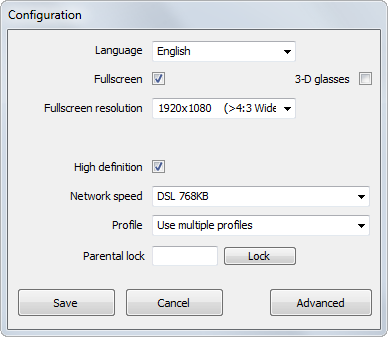
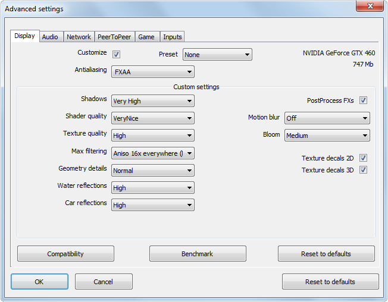
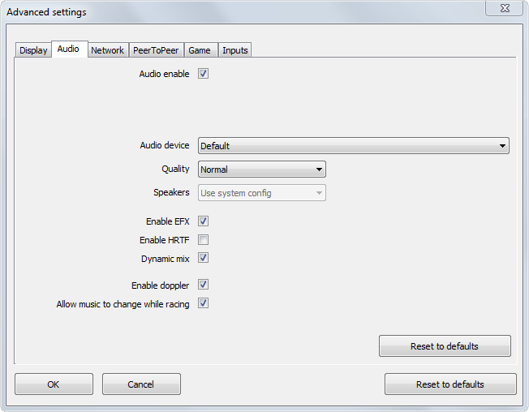
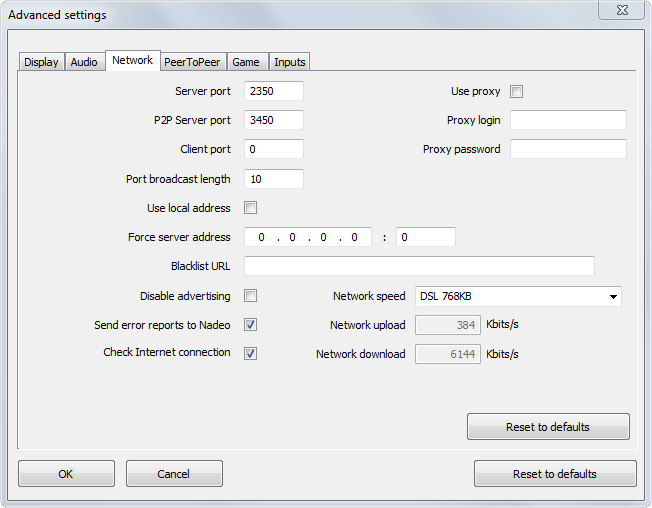
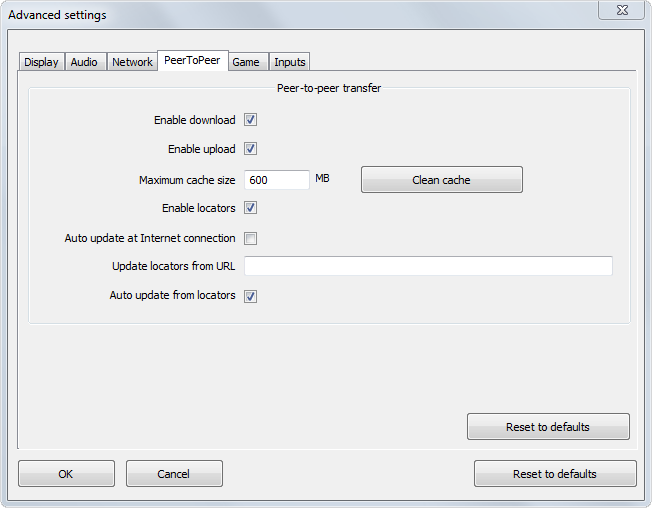
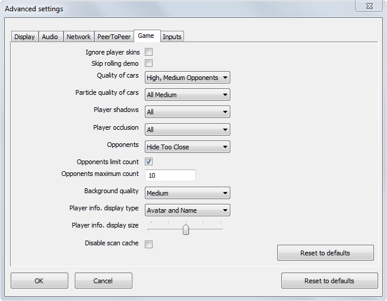

[TOC]

When it is started for the first time, the game automatically detects your computer’s configuration and applies the correct settings. You are, however, able to apply the game’s settings yourself by clicking on the 'Configure' tab of the launcher.

Simple configuration allows you to modify certain settings, including notably the language, the screen resolution and the connection options. In order to access the advanced configuration, click on 'Advanced' at the bottom right of the window (cf. 'Advanced configuration' section).

!!! If you wish to improve the game’s performance, it is advisable to reduce the different graphics settings.

## Simple configuration

**Language:** you are able to choose the language of the Mania**Planet** client from the languages offered to you.

**Full-screen:** you are able to choose to play in full-screen mode (ticked) or in window mode (not ticked). Full-screen mode displays the game over the whole of your screen, whereas window mode allows you to resize the game’s window at your convenience and access the desktop or other applications.

**3D glasses:** this option allows you to apply the display of the game in stereoscopic 3D, known as 'anaglyphic' 3D, that is to say a display of two superimposed images (with a slight shift), generally red and cyan in colour, each image corresponding to a different eye. In order to benefit from this display, you must have special glasses, with red and cyan filters.

**Profile:** enables you to specify whether you wish to allow the possibility of hosting several profiles on your Mania**Planet** client. The different profiles, thus hosted, are displayed when ManiaPlanet is started. The options are the following: Use one single profile / Use several profiles.

**Parental lock:** enter a password in order to lock using the game.
In order to save your changes, click on the 'Save' button. If you wish to delete your changes, click on the 'Delete' button. This button will close the configuration window.

In order to access the advanced options, click on the 'Advanced' button.

## Advanced configuration

### Display

**Customise:** allows you to apply your own settings to the game’s graphics options, from the list of settings proposed below and in the different tabs from the 'Advanced settings' window.

**Pre-settings:** allows you to choose pre-recorded settings from a selection of profiles:

**Any:** allows you to independently specify the settings that you wish to apply.

**VeryFast:** profile if you wish to have the smoothest possible game, at the expense of the quality of the graphics.

**Fast:** profile if you wish to have a smooth game, whilst having a higher graphics quality than the **'VeryFast**' mode.

**Nice:** balanced profile between the game’s fluidity and graphics quality.

**VeryNice:** profile if you wish to have a high graphics quality, at the expense of the game’s fluidity.

**Ultra:** profile if you wish to have the highest possible graphics quality, at the expense of the game’s fluidity.

**Anti-aliasing:** allows you to smooth out the aliasing present on the contours of an object in 3D. The higher the anti-aliasing is, the more important the smoothing out of the contours is, and the more attractive the graphics rendering is. Available settings: Any / 2 samples / 4 samples / 6 samples / 8 samples / 16 samples.

>>>>> If you select a high graphics quality, the game will require more resources in order to function (processor, random access memory, graphics card).
>>>>> The custom settings are all available if the 'Any' option is selected in the 'Pre-settings'.

**Shadows:** allows you to adjust the quality of the shadows of the 3D models.

**Shader Quality:** allows you to adjust the quality of the diffusion of lights, reflections, refractions and shadows.

**Texture Quality:** allows you to adjust the quality of the textures.

**Max. Filtering:** allows you to improve the sharpness of distant objects. The higher the value is, the greater the sharpness is.

**Water reflects:** allows you to adjust the quality of the reflection of the water.

**Car reflects:** allows you to adjust the quality of the reflections on the cars.

**PostProcess FXs:** allows you to adjust the following effects:

***Motion Blur:** allows you to activate the motion blur, otherwise called kinetic blur.

***Bloom:** blur effect on the abrupt transitions between a bright area and a dark area.

### Audio

**Activate the sound:** allows you to activate the sound in the game.

**Audio Device:** allows you to choose the device desired in order to operate the audio rendering: sound card integrated into the motherboard, internal sound card, external sound card, etc. 

***Settings:** default / depending on the device.

**Quality:** allows you to adjust the quality of the sound.

***Settings:** Low / Normal / High

**Speakers:** allows you to choose the Windows default configuration.

**Activate EAX:** the EAX, or 'Environmental Audio eXtensions', is an application programming interface which allows you to have a realistic 3D sound reproduction. Activating the EAX allows you to have a better reproduction of the sound in a 3D environment.

**Enable doppler:** allows you to activate the doppler effect.
Allow music to change while racing: allows you to download the music proposed by the server on which you are playing and to listen to it.

**Dynamic mix:** Allows you to adjust the sound level of the game dynamically. 

### Network

**Server Port:** when a server is created, it allows you to specify the open port on the local machine onto which clients are able to log.

**P2P Server Port:** allows you to specify the open port on the local machine onto which other clients are able to log in order to share data.

**Client Port:** allows you to specify the open port on the local machine as a client in order to interact with a server. If the value is specified at zero (default value), then the client will itself determine which port to open.

**Number of ports to scan:** allows you to adjust the number of ports to scan in order to detect the servers present on the local area network.

**Use Local Address:** when a server is created, it allows you to use the local IP address of the machine as an IP address of the server.

*When the option is ticked, the server which is created will be published with the local IP address of the machine instead of its public IP address.

**Force Server Address:** when a server is created, it allows you to force the IP address of the server with the value specified.

**Blacklist URL:** allows you to banish unwanted URLs.

**Disable Advertising:** allows you to disable the in-game advertising.

**Send error reports to NADEO:** if this box is ticked, on each occasion that your game shuts down unexpectedly, an error report, also called a 'log', is sent to the development teams so that they are able to correct the problem. It is therefore very important to leave this box ticked so that **NADEO** is able to improve Mania**Planet**. Error reports are sent automatically thanks to the email sending software installed on your computer (Outlook, Thunderbird, etc.).

**Check internet connection:** allows you to check whether your Internet connection is active and functional.

**Use Proxy:** allows you to use a proxy.

**Proxy Login:** enter here the username for the proxy.

**Proxy Password:** enter here the password for the proxy.

### Peer to peer

**Enable download:** allows you to download the skins and klaxons shared by the other players present on the online multi-player game server.

**Enable upload:** allows you to send your skins and klaxons to the other players present on the server on which you are playing.

**Maximum cache size:** maximum size allocated for the hosting of the skins and klaxons of the other players on your computer. Click on 'Clean the cache' in order to empty the cache.

**Enable locators:** allows you to authorise the downloading and updating of content created by players, directly from a remote server, and not from peer to peer.

**Auto-update at internet connect:** allows you to check, each time it is started, whether your version of the game is up-to-date. If this is not the case, the latest version will be offered to you as a direct download.

**Update locators from url:** allows you to provide an update of the locators’ content.

**Auto-update from locators:** allows you to update the content downloaded automatically.

### Game

**Ignore Player Skins:** if ticked, it allows you to ignore the skins of the other players’ cars in a local area network and in an online game.

**Skip Rolling Demo:** allows you to disable the demo mode after a short period of inactivity.

**Cars Quality:** allows you to adjust the quality of the display of your car or the cars of your opponents.

**Cars Particles Quality:** allows you to adjust the quality of the particles displayed by the car (sparks, dust, etc.).

**Player shadows:** allows you to display the shadows that the car projects on the environment.

**Player occlusion:** allows you to display the shadows projected under the car.

**Opponents (Hide Too Close / Always Visible):** hides the vehicles close to your car / displays the vehicles, even those close to your car.

**Opponents Limit Count:** limits the number of opponents displayed.

**Background Quality:** allows you to adjust the quality of the background (scenery).

**Disable scan cache:** allows you to disable the scanning of the cache when the game is started.

### Inputs

**Activate rumble:** allows you to activate the force feedback on the steering wheels offering this option or to activate the rumble on the gamepads / controllers.

**Freeze Unused Axis:** allows you to lock the unused axis in order to avoid pressing a wrong button by mistake.

**Exclusive keyboard capture:** allows you to restrict the use of the Windows® keyboard to the sole use of the game, whilst excluding other applications.

### Others

**Default Values:** allows you for each tab, or for the window, to restore the default values if you have made a change.

**Ok:** allows you to validate changes made to the 'Advanced settings'. Do not forget to click on 'Save' in the 'Configuration' parent window.

**Delete:** deletes the changes and closes the 'Advanced settings' window.