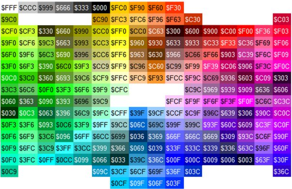

Whenever you type text in Maniaplanet, you can customize the text formatting with simple control characters. You can for example use this to customize your nickname in the profile menu.

## Control characters

|  Control character  |  Formatting  |
|  :-----          |  :-----          |
|  ``$w``  |  Wide  |
|  ``$n``  |  Narrow  |
|  ``$o``  |  Bold  |
|  ``$i``  |  Italic  |
|  ``$t``  |  Uppercase  |
|  ``$s``  |  Drop shadow  |
|  ``$g``  |  Reset to default color  |
|  ``$z``  |  Reset to default text size  |
|  ``$$``  |  Display a $ character  |

## Colors

You can use colors with a 3-character hexadecimal code of the desired colour appended to the ``$`` sign:

- Each 3 characters can have 16 values from 0 to f (`0123456789abcdef`).
- The first character is the red colour pallet, then green and blue.

Here a few examples 

- $000: black  
- $f00: red  
- $0f0: green  
- $00f: blue  
- $f80: orange  
- $ff0: yellow  
- $f0f: pink  
- $0ff: light blue  
- $888: grey  
- $fff: white

Here is a cheatsheet:

## Examples

- `$08FNadeo` will display Nadeo (ie. blue text)
- `$o$t$08FNadeo` will display <strong>NADEO</strong> (ie. bold, uppercase and blue text)

## Resources

- [Nickr](http://nickr.brun.pl/) is a Website to help you compose your custom nickname.