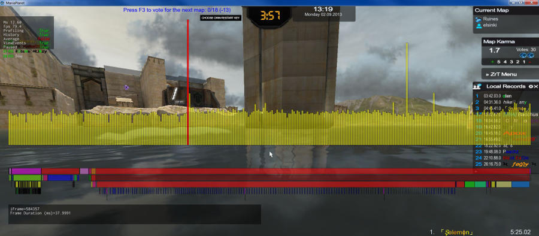
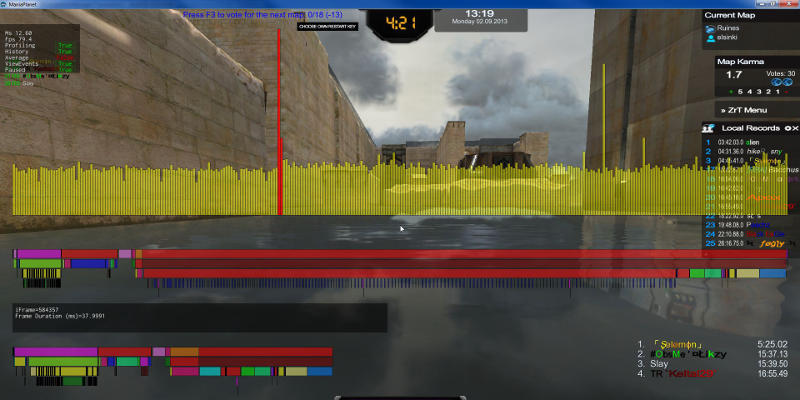

1. To start the debugger, press `Ctrl + F7`
You will have an histogram in the middle of the screen, and a little window in the top left corner:

2. When you have a micro freeze, you will have a slightly higher bar, click on `Paused: False` to freeze the histogram.
(Press `Alt` to unlock the mouse in game)

3. When the histogram is stopped, click on the highest bar to show the detail:

4. You can click on a second bar to get a comparison:

5. Press `F10` and go to `MyDocument\ManiaPlanet\ScreenShots` folder to get the screenshot.

Profesional tips / Advanced tips:
These tips are for professionals and for bugs, issues, micro-freezes that can help advance the game-developers.

6. Press `F12` and you will see information about CPU Usage aswell as GPU Usage:

7. Press `Ctrl+F11` 3 times to get the following window:

It will show the TCpu or TGpu. It will help Nadeo to see if it is a CPU issue or GPU one.

Press `F10` to make a screenshot or do a printscreen and save it in Paint or any other graphic design tool and save it in a webformat like a .png or .jpg.