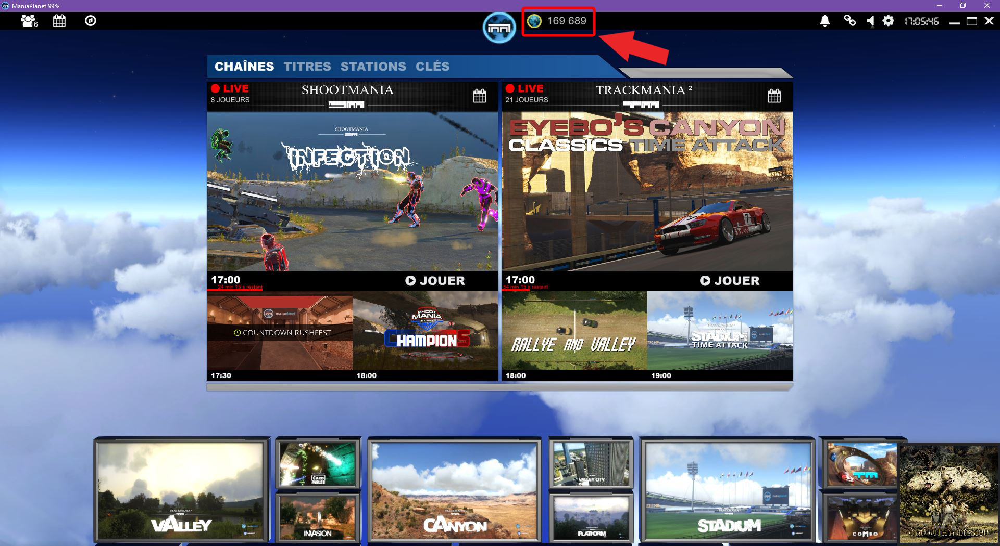

Planets is the virtual currency for ManiaPlanet games.

You can see your current total of Planets on the ManiaPlanet navigation toolbar on top of your screen.

## Gain Planets
There is many ways to gain Planets in ManiaPlanet:

* 20 Planets at the first connexion of the day (per environment owned, i.e: Trackmania² Canyon, Trackmania² Valley, Trackmania² Lagoon, , Shootmania Storm) and 10 planets for Trackmania² Stadium
* 10, 20 or/and 30 Planets following the medals that you earn in official mode in the solo campaigns of the environments (Trackmania² Canyon, Trackmania² Valley, Trackmania² Lagoon, Trackmania² Stadium)
* 100 Planets when you win 1000 Ladder Points
* Bonus month (20 Planets by title/day but it's not implemented yet)
* Sell avatars/scripts/maps/macroblocks/skins/3D models to the players via Manialink webpages.

## Spend Planets
But you can spend them in different ways too:

* Several services available on the Maniaplanet website use Planets to do actions (like uploading a map, set a ladder server, test a server on the Nadeo infrastructure, etc.)
* Buying customization stuff from the players in their Manialink webpages ingame.
* The month Planet balance
