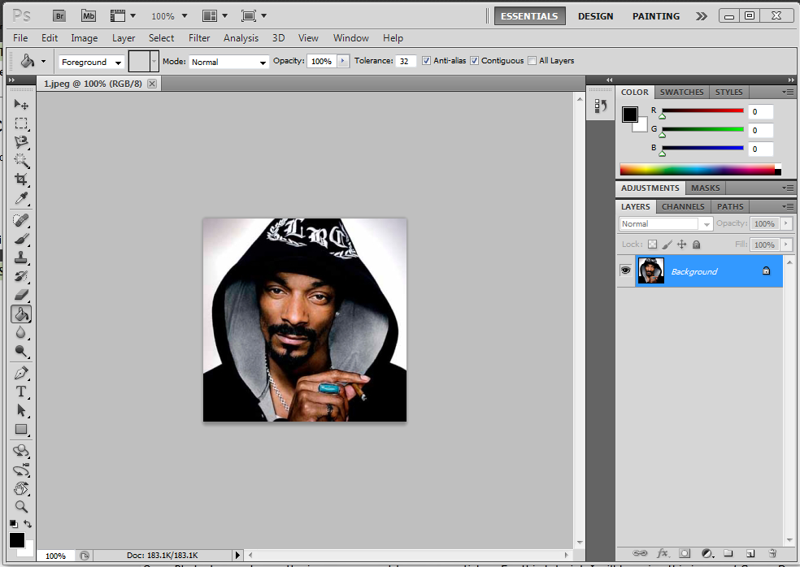
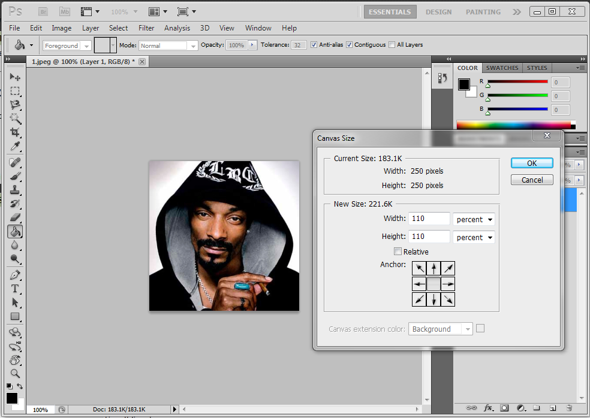
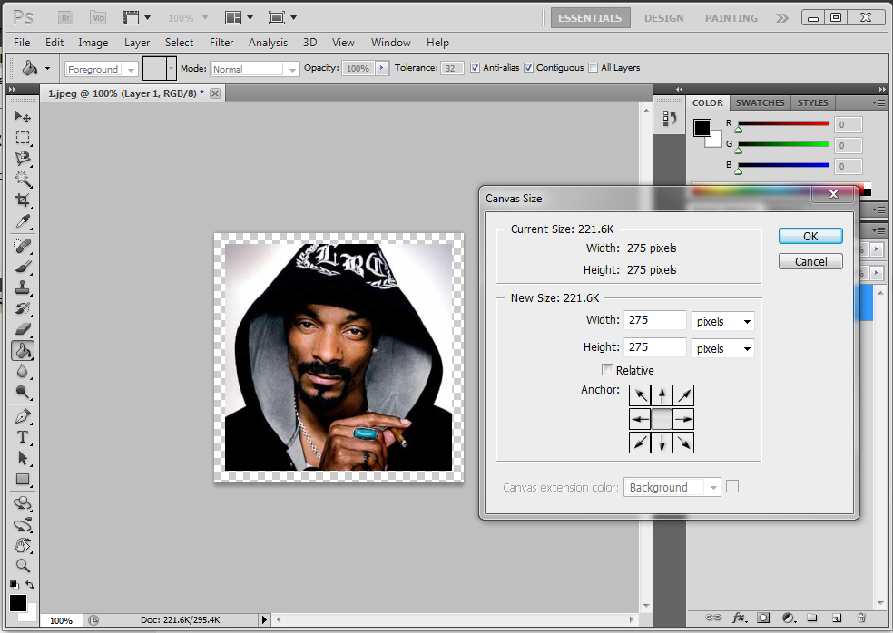
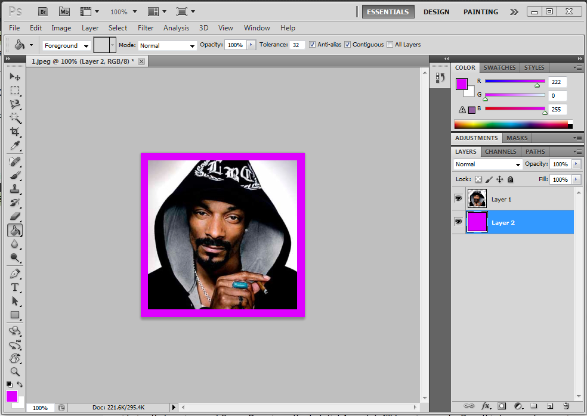
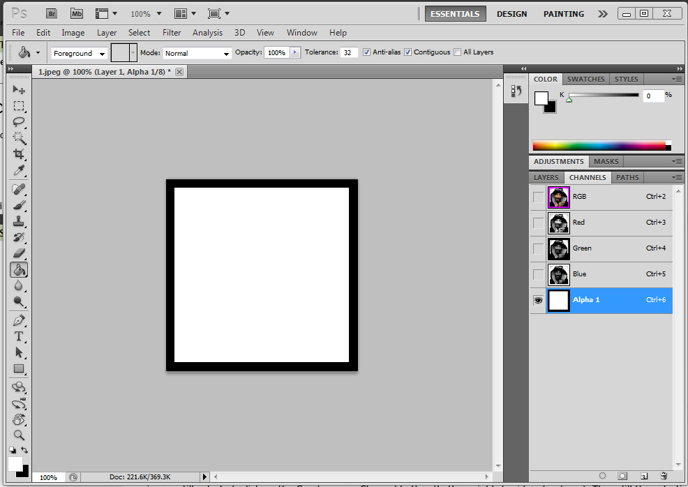
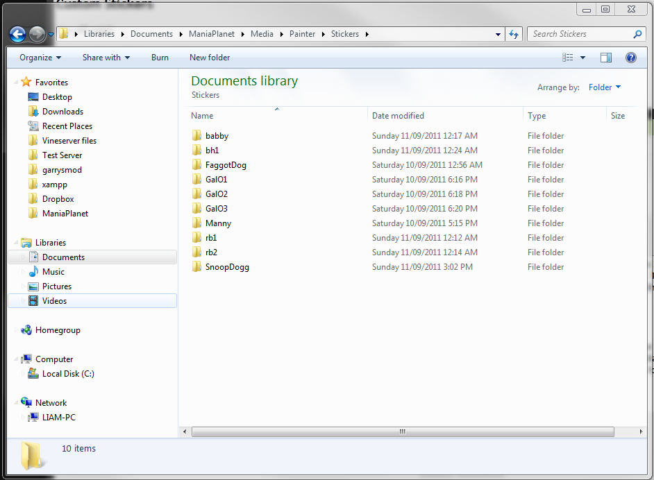
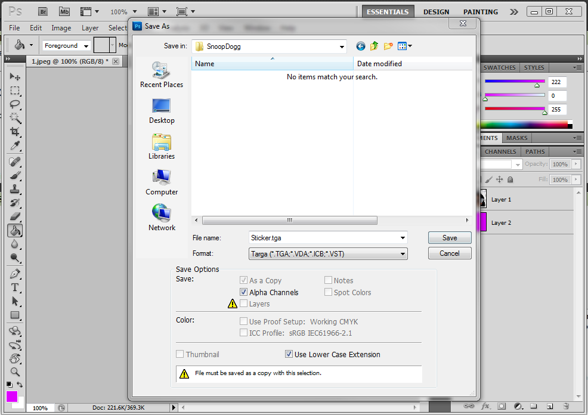

You will need:

* An image that you want to use as a sticker
* Photoshop
* NVIDIA Plugin for Photoshop

Alternatively you can use [GIMP][1] and [this plugin][2] but it's not covered in this tutorial.

First, download the [NVIDIA Plugin][3] and install it.

Open Photoshop and open the image you want to use as a sticker. For this tutorial, I will be using this image of Snoop Dogg.

Create a new layer. Then select your entire image (CTRL + A), cut it (CTRL + X) and paste it (CTRL + V) on to the new layer. Delete the empty background layer.

Click `Image` -> `Canvas Size...` (ALT + CTRL + C). Select Percent in the drop down menu, change both values to 110 and press `OK`. Sometimes if your image comes too close to the edge of your canvas, it will bleed colours when you apply the sticker to a car.

Now it's time to add a background. Create a new layer and fill it with a colour that doesn't match your image. I normally use black here but considering that my image of Snoop Dogg is pretty dark (inb4 racets), I'll be using purple. Drag this layer under your image layer.

Now for the alpha channel. Hold CTRL and left click on the thumbnail of the layer your image is on. Then click on the Channels tab above the layers.

Now for the alpha channel. Hold CTRL and left click on the thumbnail of the layer your image is on. Then click on the Channels tab above the layers. Usually, Photoshop will create an alpha channel automatically but if you don't see an Alpha 1 channel here, keep reading.  
With your image still selected, click on the Create a new Channel button (bottom-right, beside a trashcan). Then, fill the selection on this channel with white. The white area determines which parts of the image are shown, you have to be careful with this when using more complex image shapes.

Now it's time to prepare to save the file. If you used the default directories when installing Trackmania 2, open your documents folder and browse to `ManiaPlanet\Media\Painter`. Now create a folder named Stickers and inside that folder, create another folder and name it after your image. I'll be naming my folder SnoopDogg. As you can see, I have a few stickers already.

Switch back to Photoshop, then click on the Layers tab and click your image layer. Now click `File` -> `Save as...` and browse to that folder you just created. Then select Targa (.tga) from the Format drop down list and name your file Sticker.  
**It must be named Sticker, otherwise it will not work.** Press save and then press OK when the Targa Options pop up appears, you don't need to change anything.

Final step, making the icon. Click `Image` -> `Image Size...` (ALT + CTRL + I) and change both Pixel Dimensions to 64. Then select `File` -> `Save as...` and browse to that same folder as before. Select `D3D/DDS` (.dds) from the Format drop down list and name your file Icon.  
**As before, it must be named Icon, otherwise it will not work.** Click save and the NVIDIA Plugin pop up will appear, make sure it is set to DXT1 RGB 4 bpp | no alpha (it's the first option in the drop down list) and do not change anything else, just click `Save`.

Now open Trackmania², select `Editors` -> `Paint` a car and select a car to paint. Then click on the Stickers button and browse through the Stickers using the arrows on the left until you find your custom sticker. Then slap some on the car.

**And you're done!**

[1]: http://www.gimp.org/
[2]: http://code.google.com/p/gimp-dds/
[3]: http://developer.nvidia.com/nvidia-texture-tools-adobe-photoshop#downloads
