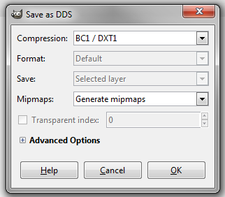

>>>>>> Tutorial from **Bonfi96** from the Maniaplanet forums

# Create your emblem #
On this tutorial, ***Gimp*** is used to edit an emblem. You can download it [on gimp.org][4], it's free.

The template to create an emblem for the Shootmania shield is available [**here**][1].

Open the template, select the "Team image" layer and place the picture your want here.

# Save correctly your emblem #

In gimp, DDS is not avaiable directly, you have to install the [GIMP-DDS][6] plugin in GIMP. It's only a matter of copying one file.

How to correctly save the file to have the image visible ingame (save it with the `.dds` filetype):

* 512x512
* BC1/DXT1
* no alpha
* with mipmaps

# Make your emblem visible ingame #

To display your emblem in ShootMania, read [**this thread**][5]

[1]: ./Emblem_Template.psd
[4]: http://www.gimp.org/
[5]: http://forum.maniaplanet.com/viewtopic.php?f=471&t=27906&p=217394#p217394
[6]: https://code.google.com/p/gimp-dds/