[TOC]

>>>>>> Tutorial from **hideou.se** from [hideou.se][1]*

Hey there. This is a tutorial for how to import your very own 3D car model into Trackmania 2. This tutorial assumes that you already know how to use 3DS Max and have a car model that you've created or imported from another game already. You will need the following programs and files if you don't already have them.

* 3DS Max (Any version will do, but all screenshots are from 3DS Max 2011)
* Adobe Photoshop (Or Gimp, I guess, but I can't help you with that.)
* [NVIDIA Texture Tools for Adobe Photoshop][2]
* [NadeoImporter.exe][3]
* [These .3ds helper files, courtesy of ManiaPark.][4]

To install NadeoImporter, put it in your ManiaPlanet install folder. This is usually ``C:\Program Files (x86)\ManiaPlanet` on a non-Steam install. For a Steam install, at least for Trackmania 2: Canyon, it's generally `C:\Program Files (x86)\Steam\steamapps\common\ManiaPlanet_TMCanyon`.

By the way, you can click on most images in the tutorial to get a proper view of them.

## Reprojection
Now, this isn't strictly about importing your model, but it's a very useful skill to have, so I'm teaching it to you anyway.

If you've imported your model from a different game, it's very likely that it came split up on several texture sheets. This won't do, because Trackmania 2 lets you use at most 2 sheets - one for the skin (what you can paint on in the in-game paint editor), and one for the details. Of course, you could manually move the texture and re-UV on top of that, but there is a much more precise and accurate way to do it, which is what I'm about to show you.

Here's the car I'm going to be porting in this tutorial. Rolling start!

For now, make sure your car is one single Editable Poly object.

The first step is to `Right Click` and hit `Clone` on your car model. Name it something like `NewUVCar` or whatever. It doesn't matter a lot, since we'll be changing that name later anyway. Make sure to make it a `Copy` and not an Instance or Reference.

Add an `Unwrap UV` modifier to your "NewUVCar" object and start re-scaling and dragging the UV-islands around so you can fit it all in a single square. A good trick is to select your islands by Material ID, so you can easily group up things that are originally on different sheets.

This is how the original UV-unwrap looked, with 3 different sheets unwrapped on top of each other:

And this is after re-arranging and scaling the UV islands:

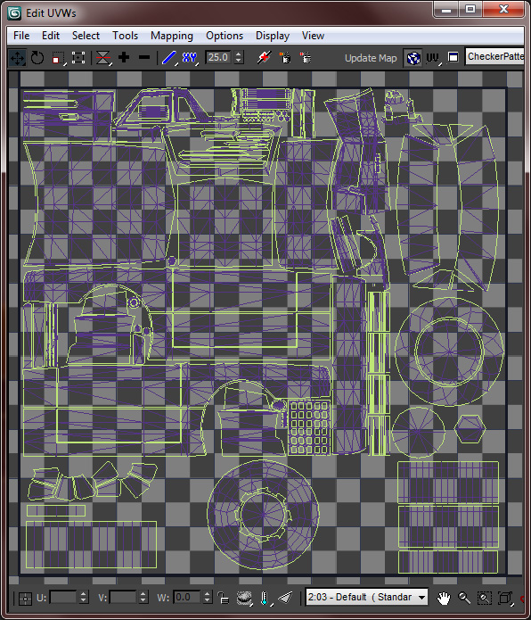

Keep in mind that you want to give things that need detail a bigger scale - so if you have a license plate, for example, don't make it tiny on the UV, or you'll get a blurry license plate. You can generally size the interior smaller than the exterior, since there's no interior camera - so you'll barely ever see the interior.

Next up, create a `Skylight`, drag it above your car, and set the light color to pure white (It starts out ever so slightly blue. If you leave it like this, your final texture will end up tinted blue, which is obviously something you don't want.)

Before we do anything else, we don't want the renderer to use the alpha maps on our materials, so go to the material panel (default hotkey M), edit your material's bitmap settings and set `Alpha Source` to `None (Opaque)`.

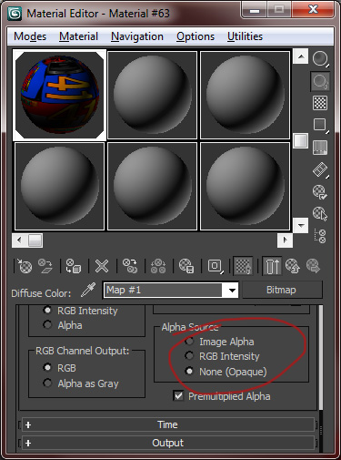

You can go ahead and `Right Click > Convert to Editable Poly` on your freshly unwrapped car now, to get rid of the UV Unwrap modifier.

Now, first make sure your renderer is set to `Default Scanline Renderer` in the `Render Setup` dialog. After that, go ahead and select your Newly UV'd car and hit 0 on your keyboard to get the `Render to Texture` dialog. Press `Add...` and select `CompleteMap`, and set the File Name to whatever you want, as a .tga file. Likewise, the resolution can be whatever you want, as long as it's a power of two and square, but you should start with a lower resolution to test with, as that does render faster. Also, make sure that in the `Mapping Coordinates` section, it's set to `Use Existing Channel` (usually 1).

Now, under the heading of `Projection Mapping`, hit `Pick...` and select your old and un-reUV'd car. Also, add a Push modifier to your NewUVCar object with a value of 0.01 - this is just to avoid any weird rendering artifacts we would otherwise get.

Hopefully, that should give you a completely working image to use on your unwrapped car. Go ahead and test it with a new material - if it looks fine, you can render it in a higher resolution, ready for the game. Keep in mind that you'll want to save texture memory, and your maximum limit is 2048x2048, so if you have a fairly undetailed or perhaps even cartoony car, you can probably stick to 1024x1024. Here's an image of my car with the newly reprojected image applied:

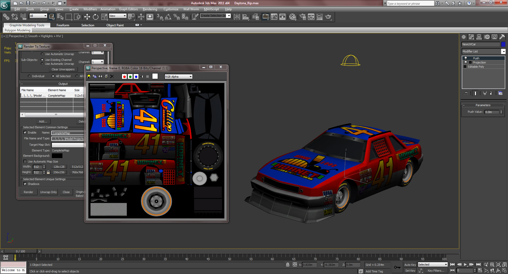

## Scale and Naming Scheme
Now, important note before we move on here - make sure your model is all on one texture sheet. It's the easiest thing to deal with, for now. If you don't know how to do that... then scroll up. Duh.

Okay, go ahead and import the `MaxBox.3ds` as well as the `canyonbody.3ds`. The MaxBox is used to demonstrate the maximum allowed scale for your model - if anything is outside this box, then your model will fail to import into the game.

Now, start scaling down your car - make sure it touches the "ground" and try to fit it inside the MaxBox. You'll want to try to get it as close as possible to the Canyonbody size as well - your car will always share the bounding box and collision model of the default car, so fitting that size will keep you from breaking immersion when your car goes tumbling. Which it definitely will.

Once you've scaled your car, go ahead and delete the MaxBox and the Canyonbody, as we don't need those two anymore.

And here comes the fun part. Name your model "dBody". The "d" in the name indicates that we want to use the Details texture sheet and material settings. Body just means that, well, it's part of the main body. Now, detach your wheels from the car. Name them as follows:

* dFLWheel - Front Left wheel
* dFRWheel - Front Right wheel
* dRLWheel - Rear Left wheel
* dRRWheel - Rear Right wheel

Again, you can see that they use the "d" prefix, to indicate that they are to use the Details sheet.
Select all the parts of your car, and hit "Reset XForm", then "Reset Selected":

Go ahead and `Right Click > Convert to Editable Poly` on the selected objects again, to collapse away the XForm modifier. Next step is to go to the Hierarchy tab, hit `Affect Pivot Only`, then `Center to Object` and finally `Align to World`. This is what lets the tires decide where to rotate around, among other things.

Now, if you have any glass parts on your body, and an interior behind them, go ahead and Detach those too, and name them as follows:

* gFWShield - Front Wind Shield
* gRWShield - Rear Wind Shield
* gBody - Any remaining glass

This allows the forward and rear windshields to break if you crash. There are other parts allowed, as well, but I'll get into those later.

## Fake shadow
Easiest step ever! Make a pure white Skylight, if you don't still have the one from the reprojection tutorial - but this time, in the modifier options for it, enable Cast Shadows.

Create a 6 by 4 Plane, using the Keyboard Entry dialog with your Top viewport selected. Give it a **pure white** material, and hit 0 for the `Render To Texture` dialog while it's selected.

You will want to render a 512x512 `CompleteMap` on the Plane. Make sure **you move it down** a unit or two, so you don't get any pure black shadows. That rarely looks good. Save this image as FakeShad.tga for now.

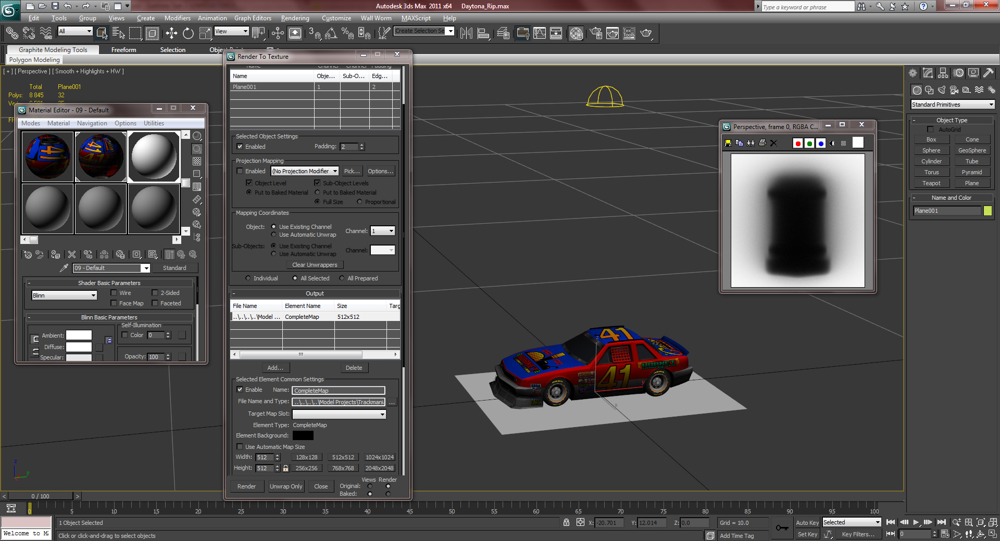

While you're at it, go open up this .tga in Photoshop, and make sure all edge pixels are pure white (#FFFFFF) - this will be translated as complete transparency on the shadow in the game. If it's not pure white, you'll have a very slightly grey box underneath your car.

Go ahead and delete the Plane and Skylight if you're done baking your shadow.

## Projectors
Import the `Lights.3ds` that you downloaded earlier.

The cone on the bottom tells the game where to project the fake shadow. It's fine in it's default position, so leave that alone.

The front cone tells the game where to project the headlights - move that so it's right in front of your car.

The back light markers define where the light trails come out of your car (which is enabled in certain parts of certain tracks, or in specific replays). Move them to your stop lights, or where they would normally be if you don't have any.

The front light markers do... something. I don't know. Move them to your front lights, logically.

The result:

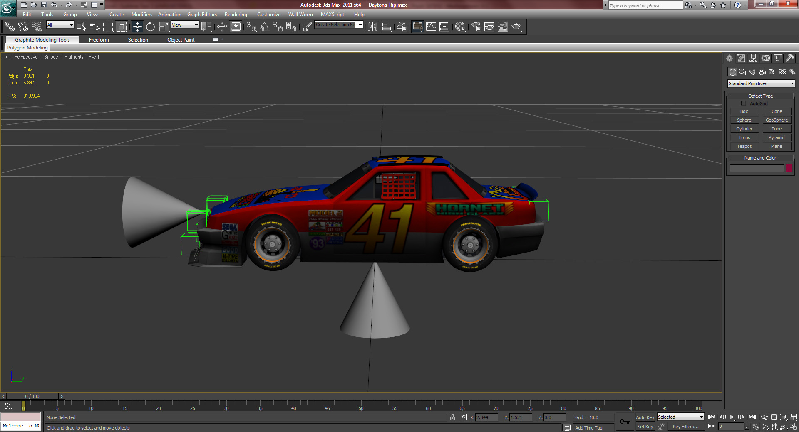

## Damage model (optional)
This step is completely optional, but it's always nice when your model deforms when you take a tumble.

`Clone` your main body model (dBody) and name it `_dBody`. Start editing it by dragging around vertices (use Soft Selection for extra sexyness)

It's **IMPORTANT** that you don't create any extra vertices for this - if you edit your base model, you will need to delete your damage model and remake it from the start again - the vertex indices need to stay the same, as the game morphs between the models depending on how the car gets damaged. Don't be afraid to really pull on the car, so it's proper noticeable in the game.

Here's a beat up Daytona car:

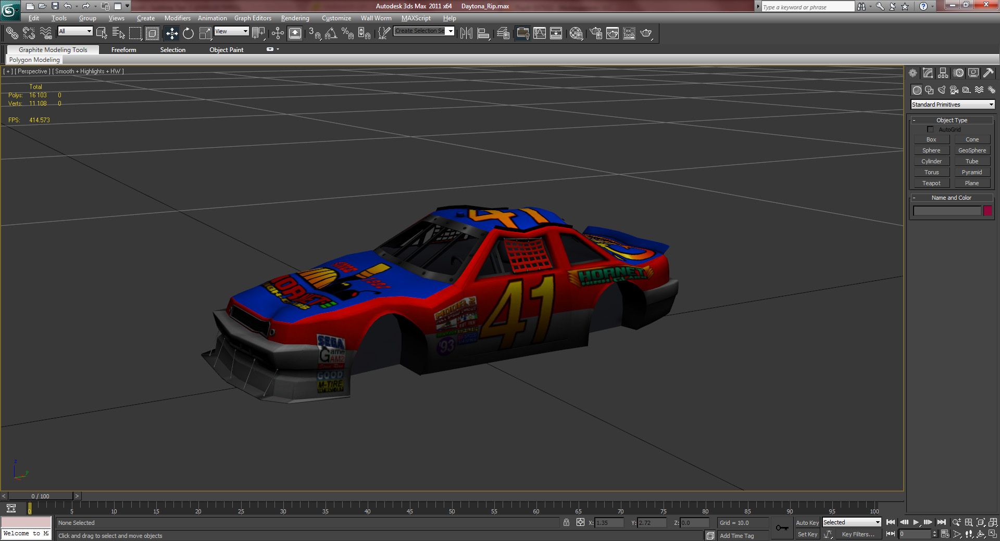

## Export
You can go ahead an `export` your first .3ds now. Save it as `MainBodyVeryHigh.3ds`.

## Low poly
Now, Trackmania 2 cars have 3 different vertex limits for it's various models. They are as follows (The damage model is not counted in the calculation):

* MainBodyVeryHigh - 60,000 Vertices
* MainBodyHigh - 20,000 Vertices
* MainBody - 4250 Vertices

None of the cars I've ported so far have been over 20,000 vertices, so I've just reused the same model for both MainBodyVeryHigh and MainBodyHigh. However, 4250 vertices isn't a lot - and the vertex count in 3DS Max seems to not be the same count that the game uses.

Go ahead and click `Save As...` in 3DS Max so you get a different project .max for your low-poly. Save it as "[carnamehere]_low" or whatever you want, really - it doesn't matter at all.

Before you do anything else, **delete your damage model** from the new file - since you're changing the amount of vertices on your original model, this one is going to be useless anyway. I never bother making a damage model for the low-poly, as it is rarely seen anyway - especially not from the driver's perspective.

Now, there's two ways you can make your low-poly model. Either edit it manually, and remove edgeloops and whatnot - this produces the best-looking result, but is tedious and takes a long time. The thing is, if you have a remotely good computer, you will never see the low-poly in-game anyway, so I never really bother making it look good. Therefore, the second way, is to use the ProOptimizer modifier, and drag it down until you have few enough vertices that the game won't get pissed when it tries to load the model. It will look like shit, but it gets the job done.

Personally, I use a combination of both - first, I edit the model and remove any standalone elements that are just details on the main body, then I run ProOptimizer on it. That helps it along a bit, and makes it distort ever so slightly less.

Go ahead and export this model as `MainBody.3ds`.

## Texture sheets
Oh boy. Your model is exported! Now we just need to get the textures in order, then we can import it into the game. I will explain what all the different textures are for, but you will (likely) only need to use `DetailsDiffuse` and `DetailsIllum` for your basic car. I'm going to use example textures from the default Canyon Car for the purpose of this tutorial.

**PLEASE NOTE that the SkinDiffuse images and such aren't used on this car, and if you've been following the tutorial precisely, it's not used on your car either. SkinDiffuse means you will need to unwrap that part of the car separately, and it's too much work for barely any gain - as I've never gotten my cars to work in the Paint editor anyway.**

* **SkinDiffuse.dds - DXT5, Interpolated Alpha**  
Material Prefix: s (i.e. sBody), alpha indicates shinyness.  

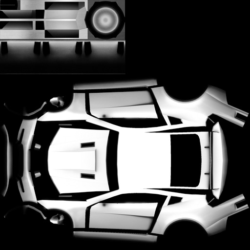
* **SkinDamage.dds - DXT5, Interpolated Alpha**  
Alpha indicates where the damage is actually painted. Think of it as a layer mask.  

* **SkinDirty.dds - DXT5, Interpolated Alpha**  
Alpha indicates where the dirt is actually painted. Think of it as a layer mask.  
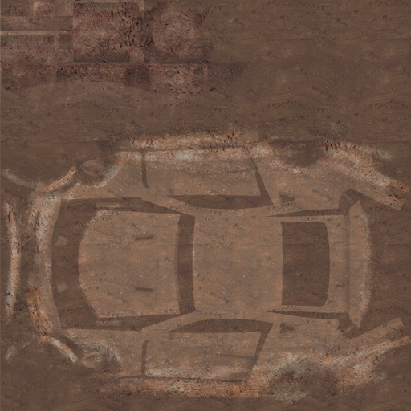

* **DetailsDiffuse.dds - DXT5, Interpolated Alpha**  
Material Prefix: d (i.e. dBody), alpha indicates shinyness. Note that the lighter the color of glass in this image, the more transparent it is in-game.  

* **DetailsIllum.dds - DXT5, Interpolated Alpha**  
Alpha indicates the type of light - fill with #676767 for **headlights**, and with black (or really near black, #030303 works - but is weaker than pure black) for **break lights**. White is just... "glow whenever"-light, good for details like the dashboard.  
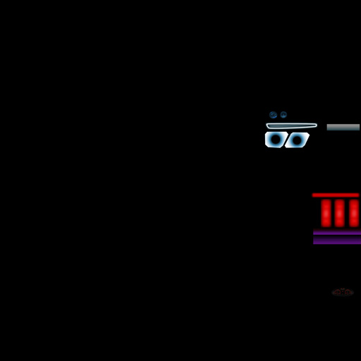

* **DetailsDamage.dds - DXT5, Interpolated Alpha**  
Alpha indicates where the damage is actually painted. Think of it as a layer mask.  

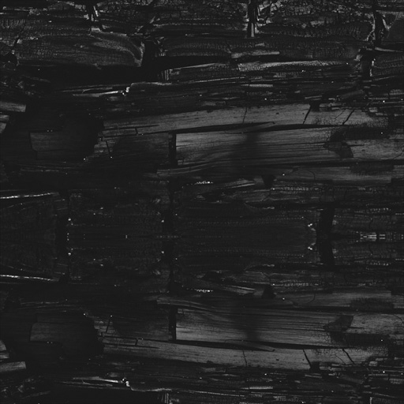
* **DetailsDirty.dds - DXT5, Interpolated Alpha**  
Alpha indicates where the dirt is actually painted. Think of it as a layer mask.  

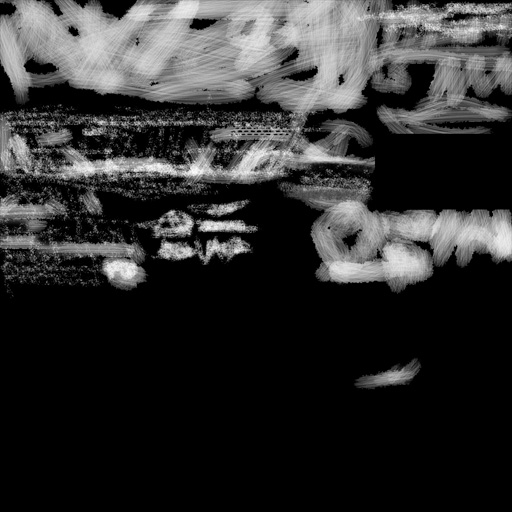
* **WheelsDiffuse.dds - DXT5, Interpolated Alpha**  
Material Prefix: w (i.e. wFLWheel), alpha indicates shinyness.  
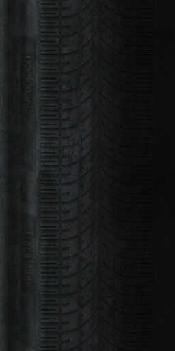

* **WheelsDirty.dds - DXT5, Interpolated Alpha**  
Alpha indicates where the dirt is actually painted. Think of it as a layer mask.  

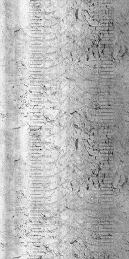
* **FakeShad.dds - DXT1, No Alpha**  
Projects the fake shadow on the ground, for weaker computers and in the paint editor/model select menu.  
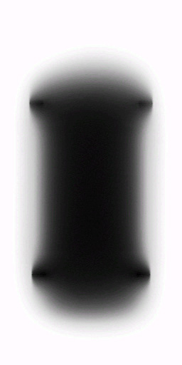
* **ProjWheelShad.dds - DXT1, No Alpha**  
Same thing as the FakeShad.dds, but for the wheels. Don't even bother replacing this - one size fits all. Unless you make a hovercar, then make it white I guess.  

* **Icon.dds - DXT5, Interpolated Alpha, NO MIPMAPS**  
Selection icon for the model select menu. Usually generated by the in-game painter, but I always make my own icons as I can never get the painter to work on my models. Alpha is transparency mask, unsurprisingly.  

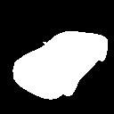

Now, the textures you don't use don't need to be in the archive - except for DetailsDamage and SkinDamage. If you're missing those, the game will crash if you crash around too much. Any other textures will be replaced by the default though - so make a pure black, 16x16 image with black alpha, export as DXT5, and use that to replace any Damage, Dirty and Illum images you aren't using - so you don't start getting the default Canyon car's dirt on your car.

## Packaging and Exporting
Oh boy, here comes the fun part. You're this close to getting to see your car in-game for the first time!

Alright, assuming you followed the instructions at the very top, you have NadeoImporter installed. If not, scroll back up - we're gonna use it now. Make a folder in your `Documents\ManiaPlanet` folder called `Temp`, and another in `Documents\ManiaPlanet\Skins\Vehicles` called `CarCommon`. These are needed for the exporter.

Go ahead and make a folder called `Source` or `Import` or `MyShittyCarImport` or whatever in the `Documents\ManiaPlanet` folder as well. Copy all your files to import in here - your .dds and .3ds files. If you haven't already, copy your `MainBodyVeryHigh.3ds` and name the copy `MainBodyHigh.3ds`.

Most of those .dds files are dummy 16x16 black images with black alpha, to avoid any conflicts or errors I could otherwise get - but you can use the texture guide above to make your own texture sheets if you want.

Hit `Windows`+`R` (or just go to run in the start menu) and enter `cmd` - we're going to do some fun console stuff now. Use the `cd` command to navigate to your ManiaPlanet folder, and enter the command show in the image - replacing `DaytonaImport` and `DaytonaTransformed` with your respective Import folder and final vehicle zip name.

Keep this cmd window open for now - if you make any changes to your skin or model you will need to re-import with this. Now, go ahead and boot up Trackmania, navigate to the `Editors` menu and enter the `Paint a Car` menu. Scroll to the very end, and hit the new icon, and you should get...

Hit `H` on your keyboard in this menu to get a few helper keys - you can test the lights, tires, damage, dirtiness, etc in here. If everything is satisfactory, move on to the next step!

## Skin.Pack.Gbx
You may have tried to go to the `Profile` menu to select your model, and then you wondered why it didn't work. Then you came back here. Welcome back, let's fix that problem.

Head back to the main ManiaPlanet menu (before you entered Canyon or Stadium), click one of the empty title squares and press `Choose`. In this menu, hit the `+` symbol at the bottom, choose `Create New Title`. Now, click on `Create New...` and fill out the Name field (description is optional). Click on `Contents`, then `Add` and navigate to `Skins\Vehicles\CarCommon` and select your car's .zip file. Hit `Create`, press `OK` in the dialog that comes up. Finally, the game will ask you if you want to set this to your Skin. The answer... is Yes, of course.

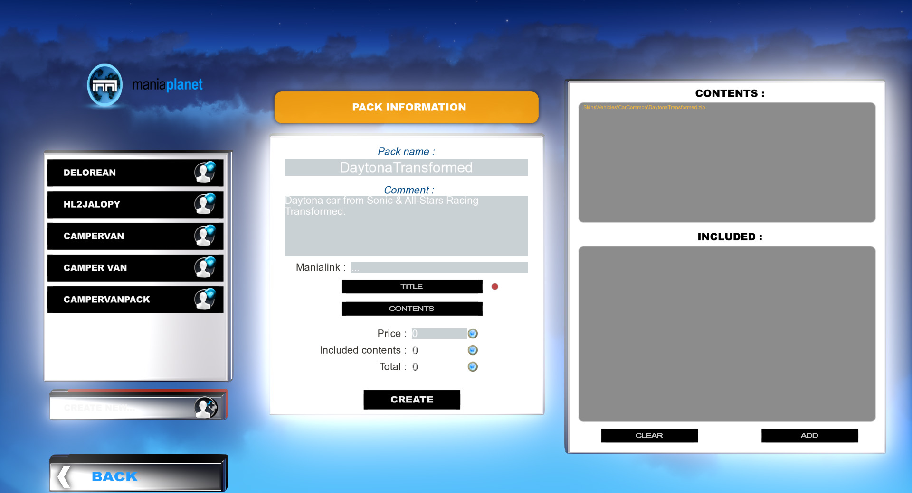

Now you can test out your car in-game!

## Locator files
Now, before you go rushing off to play multiplayer with your sexy new car, you will want to create a locator file. This is done by creating a new empty text file next to your Car.Skin.Pack.Gbx - give it the exact same name of your file, plus .loc. So if your skin is `Facepunch.Skin.Pack.Gbx` then call your locator file `Facepunch.Skin.Pack.Gbx.loc`. Inside the locator file, put a simple string indicating where your file is hosted, for example `http://hideou.se/trackmania/DaytonaTransformed.Skin.Pack.Gbx`. Which, incidentally, is a link to the skin I created during this tutorial.

This file will tell other players where your skin is hosted - so they can automatically download it and display your skin on their end. That way, you don't end up looking like a grey Canyon Car.

And that's it for this tutorial! I hope it was helpful to you, and hey, if you'd like to donate some planets, my name is Hideous in the game. See you on the racetrack!

[1]: http://hideou.se/trackmania/
[2]: https://developer.nvidia.com/nvidia-texture-tools-adobe-photoshop
[3]: http://files.maniaplanet.com/tools/NadeoImporter.zip
[4]: helpers.zip