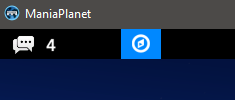
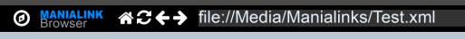

[TOC]

ManiaLinks are the "web pages" of ManiaPlanet. It's sort of like HTML, but different. They can exist in multiple different contexts, for example in the Manialink browser, in servers through XMLRPC, in scripted gamemodes, etc.

ManiaLinks also refer to a short alias for a web page (like a domain name) in Maniaplanet. You can register one on the [on the Player page](https://prod.live.maniaplanet.com/account/manialinks).

## The structure of Manialinks
ManiaLinks are very similar to the XML language except it's using specific tags. Manialink tag indicate what we're going to see on the screen. 

```
<?xml version="1.0" encoding="utf-8" standalone="yes" ?>
<manialink version="3">
    <label text="Hello World!" />
</manialink>
```


This allow to tell which version of the xml that we use and the encoding format. In ManiaPlanet, we use UTF-8 because it allows to take into consideration specials characters.
```
<?xml version="1.0" encoding="utf-8" standalone="yes" ?>
```


The manialink had several versions during its life. From Maniaplanet 4, you should use the third version of the manialink when you declare it on your file.
```
<manialink version="3">
```


This line allow to write a text. In that case, it'll be written Hello World. As there is no parameters added in this line, the text will be centered in height and the letter "H" will be centered on the width. `<label>` is called a tag in Manialink, like in XML.
```<label text="Hello World!" />```

This means that we'll finish our ManiaLink page.```</manialink>```

## Testing your Manialink
It's easy to test Manialinks locally in the Manialink browser without having to host a webserver. Simply place your XML file in your user folder (typically located at `C:/Users/Hylis/Documents/Maniaplanet/`). The best place to put it is in `Media/Manialinks`.

For example, if you have a Manialink `Test.xml` that you want to quickly test, put it in `C:/Users/Hylis/Documents/Maniaplanet/Media/Manialinks/Test.xml`.

Then, in Maniaplanet, open the Manialink browser by clicking this button:



And typing the following URL into the URL bar: `file://Media/Manialinks/Test.xml`



## Place an element in Manialink
Let see now the cooordinates to place the elements on our page.

The coordinates in X go to -160 to 160, in Y to -90 to 90. z-index has a very high ceilling (you can go up to -999/999 for example).

To place an element, you have only to add `pos="X Y" z-index="Z"` in a marker. X, Y are the coordinates and Z the depth of the element (relative to the current frame). `z-index` is mandatory if you want to see the element you're placing.

For the size of a element, you have only to add `size="X Y"` in a marker. X and Y are the size on X and on Y.

It's possible to align an element to related to the coordinates given with `<halign>` in horizontal or `<valign>` in vertical and in adding either center, left, right for halign and top, center, bottom for valign. this can be useful for texts and then to center them in a block.

## Common Manialink tags

### frame
`<frame>` : a frame is a set of elements that we stick together with the tag `<frame>`. A frame is a non-visible element but we can move the ensemble of the frame at the same time, which will allow to earn some time to place the elements to one from each other.

In our example, the first quad is placed at the location X=10, Y=10 and Z-INDEX=0. The second one is placed at X=-10, Y=0 and Z-INDEX=0 in comparaison to the frame, so en X=0, Y=10 and Z-INDEX=0 in absolute position.
```
<frame pos="10 10" z-index="0">
    <quad size="10 10" bgcolor="F00A" />
    <quad pos="-10 0" z-index="0" size="10 10" bgcolor="00FA" />
</frame>
```
The common attributes used with this tag are: *id*, *pos*, *z-index*, *size*, *valign*, *halign*.

### framemodel
`<framemodel>` : A framemodel is a frame that you'll use as a model if you need to do multiple frames with the same layout and you may need to edit them at some point without editing each one of them.
```
<framemodel id="Framemodel_Name">
    <quad size="10 10" bgcolor="F00A" />
    <quad pos="-10 0" z-index="0" size="10 10" bgcolor="00FA" />
</framemodel>
```
The common attributes used with this tag are: *id*, *pos*, *z-index*, *size*, *valign*, *halign*.

### frameinstance
`<frameinstance>` : it's the instance of a framemodel, which means it's a frame using the model of the framemodel indicated.
```
<frameinstance modelid="Framemodel_Name" id="Frame_Name" pos="0 0" z-index="0" valign="center" halign="center" />
```
The common attributes used with this tag are: *id*, *pos*, *z-index*, *size*, *valign*, *halign*.

### quad
`<quad>` : allow to insert an element as a picture, a block with a background or a ManiaPlanet element which are available on the ManiaLink « styles ».

In our example, we display a rectangle of 10x10 with a blue background. For the color code, this is in hexadecimal, this is working like the username in the game and the fourth character match with 0 without transparency and F entirely transparent.
```
<quad pos="-10 0" z-index=0 size="10 10" bgcolor="00FA" />
```
The common attributes used with this tag are: *id*, *pos*, *z-index*, *size*, *valign*, *halign*, *style*, *substyle*, *bgcolor*, *scriptevents*.

### label
`<label>` : allow to display text with differents styles which are available on the ManiaLink « styles ».

The common attributes used with this tag are: *id*, *pos*, *z-index*, *size*, *valign*, *halign*, *style*, *substyle*, *bgcolor*, *scriptevents*.

### audio
`<audio>` : allow to put an audio file on a ManiaLink with a button or to stop the music. play="1" means that the song will be loaded, else to have to put 0.
looping="0" signifie que la musique ne recommencera pas à la fin, sinon il faut mettre 1.
```
<audio data="./audio.ogg" play="1" looping="0" />
```

### music
`<music>` : allow to put an audio file but without that the visitor can lstart or stop the music, it will be launched automatically in background after the loading. Only ogg files or mux are accepted. The line must be outside of `<frame>`.
```
<music data="./music.ogg" />
```

### include
`<include>` : allow to insert a xml file.
```
<include url="./page.xml" />
```
