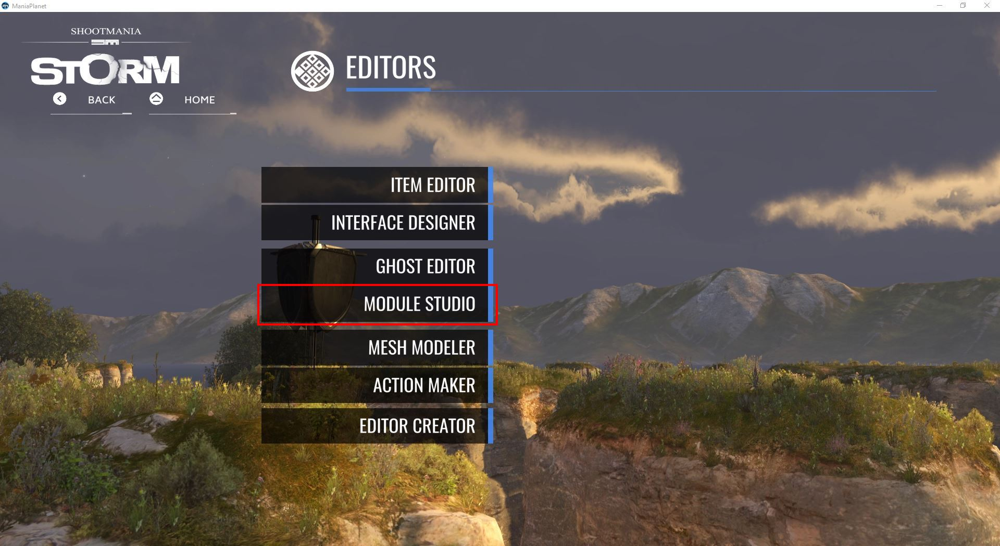
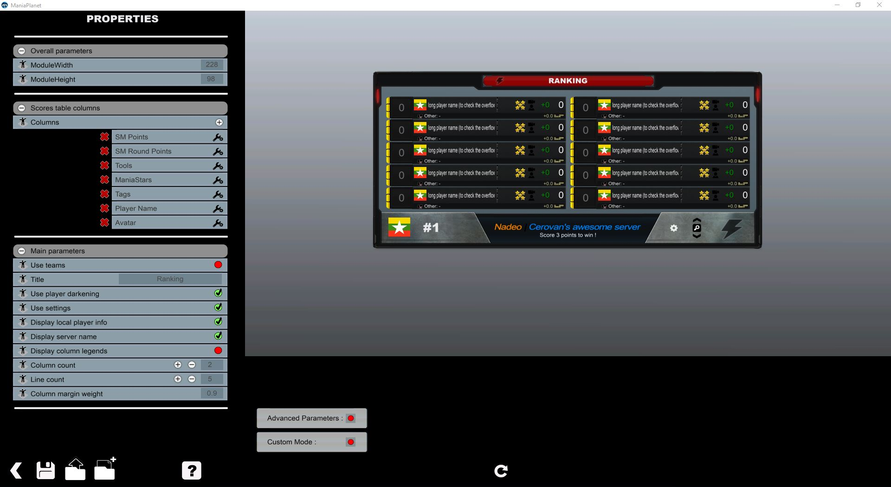

From Maniaplanet 4, with the module studio, you are able to create a scoretable based on the default from Maniaplanet yet highly customizable.

First open up Maniaplanet, then a title pack, select ***Title Tools*** in ***Editors***. Then select the ***Module Studio*** menu.




Now you have to load the ScoreTable module (from one of the game mode if you want a configuration close to one of those).


Now you have access to a large range of settings that you can modify, as well as add or remove elements in the scoretable.



Enabling the ***Advanced Parameters*** allow to change some or all the images of the scoretable.

Once you have customized the scoretable, You must create a HUD (still inside the Module Studio and where the content can be empty except for the scoretable) and load it in the gamemode script.

```java
Hud_Load("file://Modules/Module_Folder/My_Module.Module.Gbx");
```

When it's loaded you can manage it directly from the script:
```java
Hud.ScoresTable.Show(UIConfig);
```