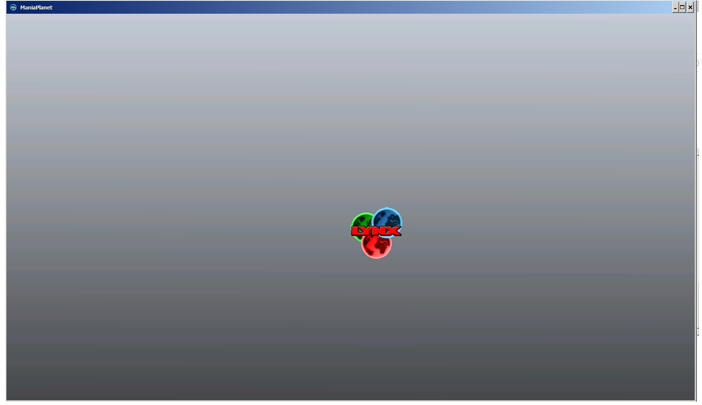

## How to get the player avatar?

```
<?xml version="1.0" encoding="utf-8" standalone="yes" ?>
<manialink version="3"/>
<quad pos="0 0" z-index="1" size="24 24" image="file://Avatars/<PLAYER LOGIN>/default" />
</manialink>
```


## How to get the Player Country flag?

```
<?xml version="1.0" encoding="utf-8" standalone="yes" ?>
<manialink version="3"/>
<quad pos="0 0" z-index="1" size="24 24" image="file://ZoneFlags/Login/<PLAYER LOGIN>/country" />
</manialink>
```


## Echelon Show to Players

Change `%d` to number 1 to 9 to show echelons

```
<?xml version="1.0" encoding="utf-8" standalone="yes" ?>
<manialink version="3"/>
<quad pos="0 0" z-index="1" size="24 24" image="file://Media/Manialinks/Common/Echelons/echelon%d.dds" />
</manialink>
```


## How to get a Country flag?

```
<?xml version="1.0" encoding="utf-8" standalone="yes" ?>
<manialink version="3"/>
<quad pos="0 0" z-index="1" size="24 24" image="file://ZoneFlags/Path/World|<CONTINENT>|<COUNTRY>" />
</manialink>
```
