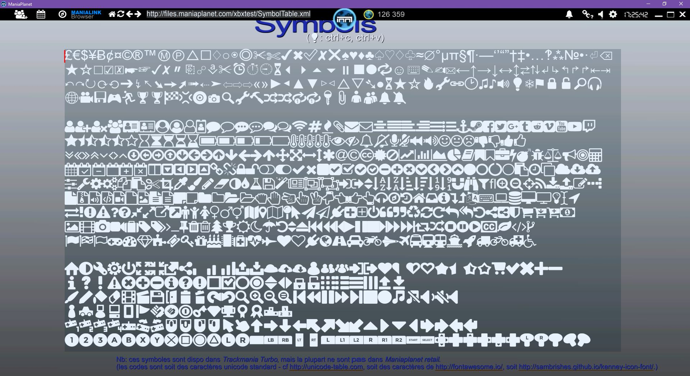

Several symbols similar to what we can find in *FontAwesome* or *FontSymbols* can be used in Maniaplanet labels. It's recommended to use them instead of images since it means better performances for your manalinks/scripts.

```
£€$¥Ƀ¢¤©®™ⓂⓅ△⬜♢○◉◎✂✄✔✖✅✘❌♠♥♦♣♤♡♢♧≈∅°µπ§¶·—‘’“”†‡•…‽⁂№•·⏎⌫
★☆☐☑☒☛☞✓✗〃⎘☍⎀✂⏰⏱⏲⏳⏴⏵⏶⏷⏸⏹⏺🔁☺⌨✎✍✉←↑→↓↔↕⇄⇅↲↳↰↱↱⇤⇥
↶↷↻⟳⟲➔↯↖➘➙➚➟⇠➤⇦⇨⇨«»►◀▲▼▷◁△▽➴●⏳★☆🔥🔧🔗🕑♫♪🔊💡❄⚑🔒🔓🔎🎧
🌐🎥💾🎮🏃🏆🏆🏁💢💿📷🔍🔧🔨🔀🔀🔂🔂🔑📎👤👥🔔🔕

















```

If you can't view some of the symbols on your web browser, just open this link in the Maniaplanet browser ingame: [http://files.maniaplanet.com/xbxtest/SymbolTable.xml](http://files.maniaplanet.com/xbxtest/SymbolTable.xml).


