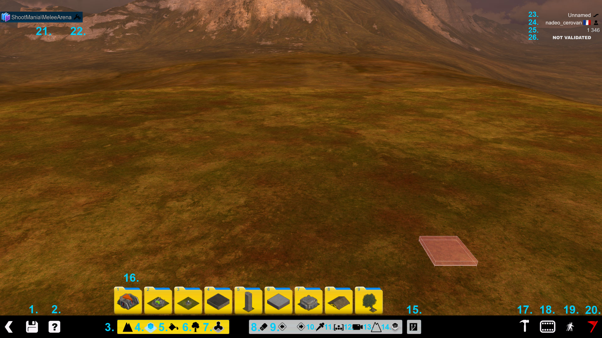

[TOC]

The map editor is one of the biggest features that Trackmania (and now Maniaplanet) is known for. It gives you the possibility to create maps for the game very easily thanks to the block system.

This article will quickly explain the interface and lay out a few building tricks.

If you want to check out all the shortcuts of the editor, they're listed on [this page][1].

# Interface

## Default interface

1. Save the map
2. Quick help information about the editor
3. Terraformation mode: to change the landscape
4. Block mode: list all blocks in the environment
5. Paint mode: used to change the image on panels and other skinnable blocks
6. Item mode: list all the custom items available in the [title pack][2] and your own `Documents\ManiaPlanet\Items` folder
7. Macroblock mode: allows placing a previous registered macroblock in the map
8. Erase mode: used to delete blocks or landscape blocks
9. Undo and Redo
10. Picker tool: used to select a block for placing by copying another block
11. Copy/paste mode: used to copy and paste multiple blocks at once
12. Freelook mode
13. Underground mode: allows to see and add blocks underground (this hides the terrain for easier editing of tunnels)
14. Offzone tool: allows to add an offzone in your map (only in ShootMania)
15. Plugin mode: allows to create and run scripted plugins for the editor
16. Blocks/Items lists
17. Advanced mode: access extra features for the map editor
18. Mediatracker: useful if you want to create a video introduction for your map or if you want to change the mood or the vision of the map
19. Test mode: instantaneously test your map at a certain position
20. Validation state: Give the state of the validation for the map
21. Shows the current maptype of the map
22. Edit the properties of certain blocks on the map
23. Name of the map
24. Username of the author
25. Weight of the map (can be used to approximate the amount of resources the game will use)
26. State of the map (validated or not validated)

## Advanced Customization tools

1. Set the MapType of the map
2. Set the map objectives
3. Edit the thumbnail of the map (used in the maplists and shown when sharing online)
4. Edit the comments of the map, useful if there is something special that you want to point out about the map
5. Add a music file that will be played with this specific map instead of the default music in ManiaPlanet (the file must be in `.ogg` format)
6. Calculate lighting, shadows, and other details on the map
7. Test the map with a specific gamemode
8. Protect your map with a password if you don't want your map to be edited by someone else
9. Allows to activate several experimental features like *Air Mapping*, *Mix Mapping*, and *Item Embedding*. **These features are experimental because maps created with these features might not work after an update of ManiaPlanet.**

# The MapType
A maptype is a file which lists all the blocks required in order for the map to be played with a specific gamemode. However, a gamemode can accept several maptypes if the gamemode creator has decided to do so.

To change the maptype of a map, you need to click on the name of the maptype in the editor and a window will open listing all the maptypes available in your `Documents\ManiaPlanet\Scripts\MapTypes` folder (and then `\ShootMania` or `\TrackMania` depending on the environment, create it if it doesn't exist). The maptype can be forced if you create a map from a Title Pack.

# Validation of a map
A map can only be played (solo play, local LAN, and online) if the map has been validated for a maptype.
This step is required each time you change (add/delete or modify) a block in a map.

Depending on the associated maptype, different blocks are required. Those are specified when you click on the validation flag while it's red.

The validation flag can have three states:

* Red: The map is not validated for the current maptype and therefore can't be played online.
* Orange: The required blocks are on the map but the map needs to be tested at least once to make sure it's working. (This state usually exists for TrackMania tracks, the map author must finish their race in order to validate it.)
* Green: The map is validated and can be played!

# Compute Shadows
ManiaPlanet uses a lightmap to enhance the visual experience of the gameplay.
During the calculation of the lightmap, shadows from blocks and lights emitted from static light like lamps and signs will be taken into account.
The lightmap is stored in the map file, this avoids players needing to do this calculation when the map is loaded.

There are different levels of shadow calculation. The higher the setting, the better the result is, but also the longer it takes.
Shadow calculation is required to save the map. And it is also necessary whenever blocks have been removed or added.
Note: the *Ultra* setting is very hungry in terms of calculating performance, therefore it is only available if explicitely selected in the advanced graphic options of the Maniaplanet Launcher utility, in the compatibility settings.
For maps with lots of blocks and lightsources, the calculation can take several minutes.

# Weight of the map
This indicator with the unit *coppers* tells how heavy the map is, in terms of utilised blocks. The name *coppers* comes from TrackMania where this was introduced first.
It's recommended to have a map of around 10.000 to 12.000 *coppers* **maximum** to be sure that the map will run on almost all computers with the minimum system requirements for ManiaPlanet.
This isn't a software limit, you're free to create maps way heavier than that, but in that case, only high-end PCs will be able to run these maps smoothly.

# Tips
*Checkpoints on Trackmania maps:*
- Make sure your checkpoints are pointing in the right direction, and that the player can resume the race also from this position. (All checkpoints respawnable.) This is especially helpful for new players.
- Place checkpoints regularly across the map, with a distance of 5 to 10 seconds between each, this is helpful on LAN and online races, where the position and the times of all the players can be monitored live.
- Add checkpoints to avoid unintended shortcuts on the map, this will make sure that drivers actually use the intended path!

# Shortcuts

## General

* F1 : Select terraforming mode
* F2 : Select block placement mode. If enabled in the extended tools (Hammer symbol) at "Experimental Features", toggles between simple block placement, Airmapping and Blockmixing
* F3 : Skin mode. Allows to change textures on blocks with panels
* F4 : Items mode: allows to place additional items, as well as third-party items
* F5 : Macroblock mode
* H : shows helper dialog
* M : toggles display of raster (On AZERTY keyboard use , instead)
* P : opens Plugins mode
* R : revert a previous usge of undo
* U : undo a previous block operation
* Z : toggles underground view to make tunnels more easily editable (On AZERTY keyboard use W instead, and on QWERTZ keyboard use Y)
* ALT + Left mouse button : move the map
* ALT + Right mouse button : rotate the map
* ALT + Mouse wheel : zoom in / zoom out the map
* Del : delete block at the cursor position
* Enter : test mode. vehicle / player model will be placed at the cursor
* Pg Up (or Mouse wheel up): raise the cursor position
* Pg Dn (or Mouse wheel down): lower the cursor position
* Space (or Left mouse button): places selected block type at the cursor position
* Right Ctrl (or Right mouse button) : rotates block selection
* Left Ctrl : Record or Playback Editors input replay (on New Map selection)
* TAB : hide / show block selection menus

## Terraforming

* BACKSPACE : Delete all kinds of terraforming, all the other blocks and items are not affected.
* Ctrl + left mouse click : selects block type at the cursor position
* X + left mouse click : deletes block at the cursor position
* C : Switches to Macroblock selection mode

## Block mode

* BACKSPACE: Delete all blocks placed in this mode. Landscape and items are not affected.
* X + left mouse click: deletes block at the cursor position

## Item mode

* BACKSPACE: Delete all blocks placed in this mode. Landscape and items are not affected.
* Ctrl + left mouse click: selects block type at the cursor position
* X + left mouse click: deletes block at the cursor position
* Arrow keys (not those on the Numeric pad!), as well as Numpad- and Numpad+: rotate item along x, y and z axes. Some items only allow rotation along vertical axis.
* Numpad/: reset item orientation to default

## Macroblock mode

* BACKSPACE: Delete all blocks in the selection
* Ctrl + left mouse click: selects block type at the cursor position

## Test Mode

* F: FlyMode (only in ShootMania)

[1]: ../../client/keyboard-shortcuts#map-editor
[2]: ../../title-pack/