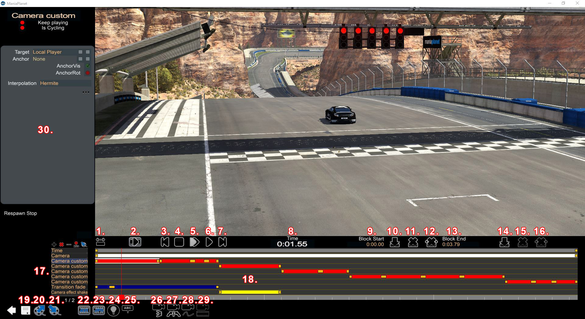
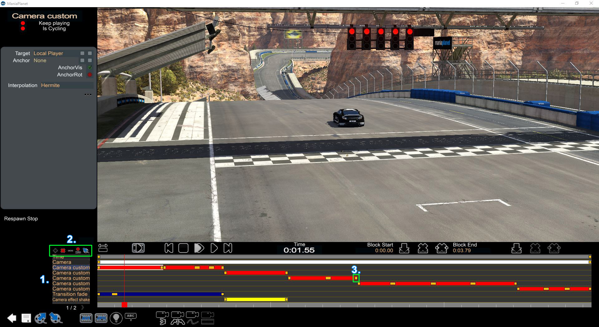
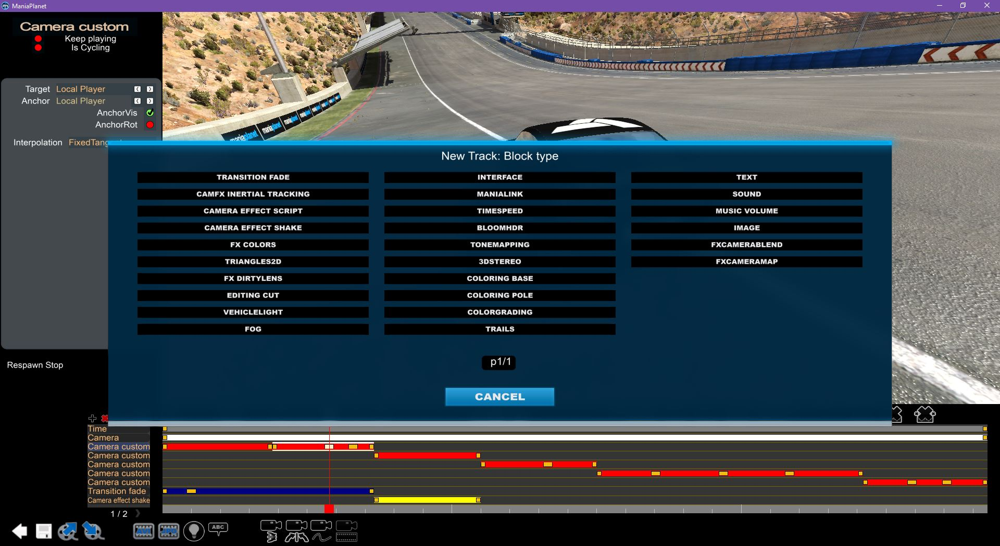

[TOC]

## Presentation

The ***Mediatracker*** is a movie editing tool for the Maniaplanet replays, similar in the idea to the Source FilmMaker for the Valve games. With the MediaTracker you can edit the replays you can create while playing in Trackmania and Shootmania. Those replays can be edited to modify the cameras, adding effects, sound/music or text for example. You can produce a very high quality video with this tool (which can be also edited further in a profesionnal movie editing software).

[plugin:youtube](https://www.youtube.com/watch?v=wpz7a-_IIuo)

## Explanations of the interface

|  Element  |  Description  |  Element  |  Description  |
|  :-----          |  :-----          |  :-----          |  :-----          |
|  1. |  Show full timeline |  21. |  Import a clip |
|  2. |  Preview of the video |  22. |  Shoot video |
|  3. |  Got to first frame |  23. |  Shoot image |
|  4. |  Stop |  24. |  Compute shadows |
|  5. |  Slow forward |  25. |  Display car names |
|  6. |  Normal forward |  26. |  Reset yaw |
|  7. |  Go to last frame |  27. |  Reset roll |
|  8. |  Time of the frame |  28. |  Switch to free camera |
|  9. |  Start time of the selected block |  29. |    |
|  10. |  Insert a block |  30. |  Properties of the selected block  |
|  11. |  Remove a block |  31. |    |
|  12. |  Cut a block |  32. |    |
|  13. |  End of the selected block |  33. |    |
|  14. |  Insert a key |  34. |    |
|  15. |  Remove a key |  35. |    |
|  16. |  Remove all keys |  36. |    |
|  17. |  list the tracks |  37. |    |
|  18. |  Timeline |  38. |    |
|  19. |  Save |  39. |    |
|  20. |  Export a clip |  40. |    |

## Useful shortcuts

Here you can find the shortcul which may be useful while using the Mediatracker.

|  Shortcut  |  Description  |
|  :-----          |  :-----          |
|  ALT + Right Click |  Rotate the camera (on a camera timeline key) |
|  Arrow keys |  Move the camera (on a camera timeline key) |
|  CTRL + Z |  Cancel |
|  CTRL + Y |  Redo |
|  CTRL + D |  Duplicate track |
|  + / - |  Speed of the camera on a camera track |

### Tips

#### Copy/paste a keyframe:
1. Click on the keyframe that you want to move.
2. While maintining CTRL, click on the keyframe tou want to copy from.

#### Move a keyframe
1. Click on the keyframe that you want to move
2. Click the keyframe you want to move to.

## Handling the cameras

To use the Mediatracker, you must first save a replay from the related title pack. Once done, you can use the Mediatracker.

In the home menu of a title pack, go in the menu ***Editors*** and then ***Replay Editor***. Now choose a replay and select the ***Advanced editor***.

You'll arrive on a screen like the one just above. The different tracks ( ***1.*** ) in timeline represent the default camera of the replay for this track. You're free to delete and to insert a new custom camera (to be able to move it as you want) ( ***2.*** ).

You can also let the tracks as they are and just modify the cameras. To move a camera, just click on it on a key (like ***3.*** ) and the can move the camera as you want.

If you add multiple keys in the same block, the mouvement to go from the first camera to the next will be automatic. To tune the transition, you should add more keys.

## Others tracks
Of course, you don't have to add only camera tracks, several others types of tracks are available in the Mediatracker. You can add special effects, texts, sounds or others things.

|  Block type  |  Effect  |
|  :-----          |  :-----          |
|  Transition fade |  Rotate the camera (on a camera timeline key) |
|  CamFx inertial tracking |  Move the camera (on a camera timeline key) |
|  Camera effect script |  Cancel |
|  Camera effect shake |  Redo |
|  Fx Colors |  Duplicate track |
|  Triangles2D |  Draw triangles on the screen |
|  FX Dirtylens |  Add dirty lens effect on the screen |
|  Editing cut |  ? |
|  Vehicule light |  Turn on the lights of the car |
|  Fog |  Add a fog effect on the sky (can also change the color of the sky) |
|  Interface |  Add a custom UI via Manialink code |
|  Manialink |  Display a manialink |
|  TimeSpeed |  Only useful for ingame Mediatracker to warp time |
|  Bloom HDR |  Add a bloom effect |
|  Tone Mapping |  Add a tone Mapping effect |
|  3D Stereo |  ? |
|  Coloring Base |  Change the color of the base in Shootmania |
|  Coloring Pole |  Change the color of the pole in Shootmania |
|  Color grading |  Add a gradient effect on the image |
|  Trails |  Add a trail effect on the player(s) |
|  Text |  Add a text on the screen |
|  Sound |  Add a sound |
|  Music Volume |  Modify the volume of the sound and the music |
|  Image |  Add an image on the screen |
|  FX Camera Blend |  Only show what see the cameras in these blocks |
|  FX Camera Map |  Allow to project something on a texture |

## Shooting/exporting a video
Once you have edited the video, you're good to export/shoot it. The easy way is simply to click on the "Shoot video" icon, choose your quality, size, the framerate and the file format. The time to shoot the video will depend on the power of your PC and the length of the video.

You can also improve and/or add effects to the video while exporting by using the advanced parameters. Using these options may considerably increase the time to export/shoot the video.

The most consuming options are the antialias, the motionblur and bitrate.

## Usage of the Mediatracker ingame

The Mediatracker can also be used in the map editor to add an introduction, an outroduction or even to change the ambiance of a track.

Some things you can add/edit to your track are:
* An introduction
* What is displayed during a race
* An outroduction
* Modify the podium sequence
* Edit the ambiance

As seen earlier, several block of the mediatracker may not be usable depending of what you're trying to do.

Some things that the map makers are used to are intro and outro and for the difficult tracks, a sequence called GPS where you see a ghost performing the track to acknowledge where the player is supposed to go.

Once you have opened the Mediatracker, in the "in-game" mode, you can add a trigger block where you want to define where your Mediatracker sequence must be triggered and so played (and for a GPS, it's usually behind the start block).

## Tips

* [Video batch](video-batch.html)

There is nothing magical or hard-to-understand about it, so don't let the dark GUI and the small buttons intimidate you :-)

* Use shift to select more replays in a map to edit them

## Video tutorial

You can also watch this tutorial from DaniXks. It's from Maniaplanet 3 (the previous major version) but still very revelant today:
[plugin:youtube](https://www.youtube.com/watch?v=S2z5AU_SBfk)