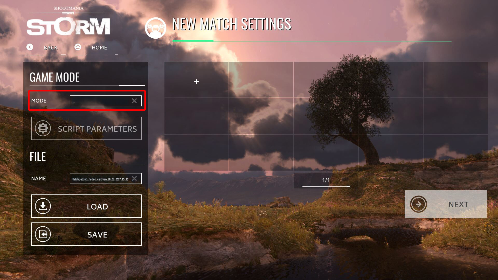

[TOC]

In this part you'll learn to create your first simple game mode, a deathmatch where the first player to earn 30 points will win the map (using a lightweight version of the Melee gamemode).

## Creating the gamemode
Firstly to be able to write your mode ingame, you have to create a text file with the following code:

		#Extends "Modes/ShootMania/ModeBase.Script.txt"

And then save the file under a name like this: `MyGamemode.Script.txt` in `C:\Users\MYUSERNAME\Documents\ManiaPlanet\Scripts\Modes\ShootMania` (create the required folders if missing).

Now you can launch a local server with your mode or via the map editor (if you want to create/modify a prototype map at the same time) or as said before you can continue in your IDE/text editor but you'll not be able to test/modify your script live (through the IDE I mean, you can modify it through the script editor ingame).

## Create a map

It's time to create a map to test our mode. Launch ManiaPlanet, start the map editor and select a maptype: `MeleeArena` for ShootMania or `Race` for TrackMania. Make a basic map, validate it and save it. Now you can exit the editor.

## Create a server

We have a basic game mode script and a map, all that is missing now is a server to do our tests. In the main menu click on the Local Play button (then Local Network if you are on TrackMania). Click on the Create button and you should see this screen:

* Click on the field to open a window where you can choose `MyGamemode.Script.txt`.

Then choose a map and click on next to choose the parameters of the server. Once done click on `Create`.

## Structure of a game mode
A gamemode is divided in several part which match each state of a game. A raw structure of a gamemode looks like this:

    #Extends "Modes/ShootMania/ModeBase.Script.txt"

    #Const	CompatibleMapTypes	"MeleeArena"
    #Const	Version				"1.0.0"
    #Const	ScriptName			"Modes/ShootMania/Melee.Script.txt"

    #Include "TextLib" as TextLib
    #Include "MathLib" as MathLib

    #Include "Libs/Nadeo/Interface.Script.txt" as Interface
    #Const C_HudModulePath "Nadeo/ShootMania/Melee/Hud.Module.Gbx" ///< Path to the hud module

    // ---------------------------------- //
    // Constants
    // ---------------------------------- //
    //List of your constant variables

    // ---------------------------------- //
    // Globales
    // ---------------------------------- //
    //List of your global variables

    ***Match_LoadHud***
    ***
    Hud_Load(C_HudModulePath);
    if (Hud != Null && Hud.ScoresTable != Null) {
        Hud.ScoresTable.Scores_Sort(CModulePlaygroundScoresTable::EScoreSortOrder::SMPoints);
    }
    ***

    ***Match_StartServer***
    ***
    //Code to execute when the server is started
    ***

    ***Match_InitMap***
    ***
    ///Code to execute when a map is initialized
    ***

    ***Match_StartMap***
    ***
    //Code to execute when a map is starting
    ***

    ***Match_Playloop***
    ***
    //Main loop where the code is executed through the duration of the round/map
    ***

    ***Match_EndMap***
    ***
    //Code to execute at the end of a match/map
    ***

    // ---------------------------------- //
    // Functions
    // ---------------------------------- //
    List of the functions of the gamemode

### **Library**

    #Extends "Modes/ShootMania/ModeBase.Script.txt"

    #Const	CompatibleMapTypes	"MeleeArena"
    #Const	Version				"1.0.0"
    #Const	ScriptName			"Modes/ShootMania/Melee.Script.txt"

    #Include "TextLib" as TextLib
    #Include "MathLib" as MathLib

    #Include "Libs/Nadeo/Interface.Script.txt" as Interface
    #Const C_HudModulePath "Nadeo/ShootMania/Melee/Hud.Module.Gbx" ///< Path to the hud module

This part is used to load all the libraries required and basic information for the gamemode. `ModeBase` is the most important part because it'll allow you to divide the gamemode for each state of the game and also to have access to all basic functions and variables for a game script.

The `CompatibleMapTypes` constant indicates which type(s) of maps are usable with your script. It can be useful if your mode requires a specific type or number of blocks (for example at least two spawns, with a pole in Royal)

`Version` is... well the version of your script, you can format it as you want.

All `#Include` lines indicate that we want to load a library into the script. A library is a collection of functions/variables which contain script modes to do a specific task (like handling the messages, the interface and more). You can also declare a custom library if you have made one and need it for your gamemode. It's particularly useful when you have to use the same block of code in several gamemodes.

### Constants

    // ---------------------------------- //
    // Constants
    // ---------------------------------- //
    #Const ConstVar ConstValue

The constants are a type of variables where you stock a value that will not change during the game and will be accessible anywhere in your script (except in the librairies). Usually in these variables you'll keep settings which are non-modifiable by the players/server owner like the maximum number of players (for example), the list of objects used in the script, the ids of the classes, the minimum number of players required for the script, etc...

Declaring a constant variable doesn't require a semicolon (;) at the end of the line.

### Globales

    // ---------------------------------- //
    // Globales
    // ---------------------------------- //
    declare Text G_GlobalVar;

Globals are like the constants with the difference that you can modify their value during the game and that you must set a type when you declare (create) them.

### "Body" of the Script
And now we attack the main dish of the script, the labels corresponding to each state of a game.

>>>>> Not all the parts are mandatory except `Match_Playloop` and `Match_EndRound` or `Match_EndMap` (one of them at least)

#### Match_StartServer

    ***Match_StartServer***
    ***
    //Code to execute when the server is started
    ***

In this block you'll set everything that needs to be set up at the start of the server at risk of not work properly during a game. Usually it's used to build the scoretable, activate the team mode (or not) or listing all the `Actions` (like custom weapons or forced skins) which will be used in the script.

#### Match_StartMap

    ***Match_StartMap***
    ***
    //Code to execute when a map is loaded
    ***

In this part you'll (usually) initialize all the variables which are used to set up a match. It's the place where you reset the global score or for setting up variables which will be used during the whole game for example.

#### Match_InitRound

    ***Match_InitRound***
    ***
    //Code to execute before the beginning of a round
    ***

This is the code that you need to execute prior to the start of a round, it could be to reset the score of a player/team (other than the global score), custom stats, setting up a gameplay sequence, etc...
Note that this section is not mandatory to have your script working.

#### Match_StartRound

    ***Match_StartRound***
    ***
    //Code to executed when a round is started
    ***

This is where you usually set up a few other variables as well as create the items required for the execution of the script (if needed at the start of the round).

#### Match_Playloop

    ***Match_Playloop***
    ***
    //Main loop where the code is executed through the duration of the round
    ***

The main dish, inside this loop you'll handle everything that happens during a round. From spawning a player to handling player death and more. You have also to set the victory condition(s) somewhere inside to leave the loop (and stop the game).

#### Match_EndRound

    ***Match_EndRound***
    ***
    //Code to execute at the end of the round
    ***

You enter here when you have met your victory condition(s) and decide what to do at this moment (end the map/match or launch a new round).
If you decide to start a new round, the script will go back at the `Match_InitRound` section and continue the script from there.

This is also the place where you destroy all the objects and bots (because you'll recreate them on the `Match_StartRound`).

#### Match_EndMap

    ***Match_EndMap***
    ***
    //Code to execute at the end of a match/map
    ***

Usually it's used to indicate who won the match and to load the next map.

### Functions

    // ---------------------------------- //
    // Functions
    // ---------------------------------- //
    //Create your functions from here

If you need to create functions (repetition of the same block of code) for your game mode, you have to create them after the `EndMap` section because when the game will compile the script, it goes from the bottom to the top of the document to check if the functions called by the script really exist in the library or in the script itself.

## Common variables
Now we can almost start the "real" work, just a bit of explanation about the type of variables existing in ManiaScript as it can change slighty between programming languages.

Here is a list of the common types of variables in ManiaScript (or how to declare them):

Type| ManiaScript type  | Example
---------   | ----------------- | -------
Integer | Integer   | 1
Real / Float| Real  | 1.5 (or 1. for a "round" number, the decimal is mandatory)
Text| Text  | 'Im a text'
Boolean | Boolean   | True
Ident   | Ident | (see below)
Array   | []| Player[] (table of Players)

An ident is special kind of variable, it's used to point to an asset (others that images/sound) like a bullet created in the ***ActionMaker***, or a ***skin*** or also an ***aura*** for example.

## Setting up the script

    #Extends "Modes/ShootMania/ModeBase.Script.txt"

    #Const	CompatibleMapTypes	"MeleeArena"
    #Const	Version				"2013-06-24"
    #Const	ScriptName			"Modes/ShootMania/Melee_Tutorial.Script.txt"

    #Include "TextLib" as TextLib
    #Include "MathLib" as MathLib
    #Include "Libs/Nadeo/Interface.Script.txt" as Interface

    // ---------------------------------- //
    // Settings
    // ---------------------------------- //
    #Setting S_TimeLimit	600 as _("Time limit")		///< Time limit on a map
    #Setting S_PointLimit	25	as _("Points limit")	///< Points limit on a map

At the beginning of your script, you have to tell the script to look in the `ModeBase` for the basic working of the script.

Then talk about the different libraries:

* Message: You handle all the system message thanks to the library (like: "A player killed you!").
* SM: Handle some general functions like spawning the players
* Score: It's used to set the score to the players (as its name says)

After you setting up the interface:

    // ---------------------------------- //
    // Constants
    // ---------------------------------- //
    #Const C_HudModulePath "Nadeo/ShootMania/Melee/Hud.Module.Gbx" ///< Path to the hud module

    ***Match_Settings***
    ***
    MB_Settings_UseDefaultHud = False;
    MB_Settings_UseDefaultTimer = False;
    ***

    ***Match_Rules***
    ***
    ModeInfo::SetName("Melee");
    ModeInfo::SetType(ModeInfo::Type_FreeForAll());
    ModeInfo::SetRules(Description);
    //L16N [Melee] Short description of the Melee game mode rules
    ModeInfo::SetStatusMessage(_("Hit a maximum of players to win the game."));
    ***

    ***Match_LoadHud***
    ***
    Hud_Load(C_HudModulePath);
    if (Hud != Null && Hud.ScoresTable != Null) {
    	Hud.ScoresTable.Scores_Sort(CModulePlaygroundScoresTable::EScoreSortOrder::SMPoints);
    }
    ***

    ***Match_SpawnScreen***
    ***
    SpawnScreen::CreateScores("Score.RoundPoints");
    ***

Below the library you have the settings that players set when they create a server.

## Initializing the server
For a deathmatch mode (which is very simple), you only have to deactivate the team mode at the start of the server.

    ***Match_StartServer***
    ***
    UseClans = False;

    Interface::CreateRank();
    ***

## Setting up the parameters for the match/map

At the initialization of the map we declare the variables we'll need to handle the proceeding during the map like the spawn, the points and the id of the best player.

    ***Match_InitMap***
    ***
    declare Integer PrevPointsLimit;
    declare Integer PrevTimeLimit;
    declare Ident[] SpawnsList;
    declare Ident LastSpawnId;
    declare Integer MaxPoints;
    declare Ident LeaderId;
    ***

Then at the start of the map, we initialize those variables and the scoretable.

    ***StartMap***
    ***
    PrevPointsLimit = S_PointsLimit;
    PrevTimeLimit = S_TimeLimit;
    SpawnsList = Ident[];
    LastSpawnId = NullId;
    MaxPoints = 0;
    LeaderId = NullId;

    if (Hud != Null && Hud.ScoresTable != Null) {
    	//L16N [Melee] Message displayed in the scores table footer informing the players about the current points limit to reach in order to win.
    	Hud.ScoresTable.SetFooterText(TL::Compose("%1 "^S_PointsLimit, _("Points limit : ")));
    }

Now we setup the EndTime of the map.

    StartTime = Now;
    if (S_TimeLimit > 0) {
    	EndTime = (StartTime + S_TimeLimit * 1000);
    } else {
    	EndTime = -1;
    }

## Proceedings of the round
It's now time to write what's going on during a round.

    ***Match_PlayLoop***
    ***
    foreach (Event, PendingEvents) {

We look at each event happening during the round. When an event is triggered, according to what we want to do, we do some treatments (only a very few events are listed below, the basic ones).

    // ---------------------------------- //
    // On armor empty
    if (Event.Type == CSmModeEvent::EType::OnArmorEmpty) {
  		if (Event.Victim != Null && (Event.Shooter == Event.Victim || Event.Shooter == Null)) {
  			Scores::RemovePlayerRoundPoints(Event.Victim.Score, 1);
  		}
  		Events::Valid(Event);
  	}

When a player loses all his armors (when he is eliminated), we remove one point from his score. Then with `Events::Valid(Event)` we tell the server that the event has been processed.

    // ---------------------------------- //
    // On hit
    else if (Event.Type == CSmModeEvent::EType::OnHit) {

Now we check if a player is hit by a projectile (from a Storm weapon).

    if (Event.Shooter == Event.Victim) {
      Events::Invalid(Event);

Basically if the player hit himself (with the `Arrow` or the `Nucleus` for example), we tell the server to disregard this event (and so to ignore all the damage and effects) with the `Events::Invalid(Event)` instruction.

        } else {
            Event.Victim.Armor -= Event.Damage;

            Events::Valid(Event);
        }
    }

But if the sender and the receiver are different, we remove the number of armor (life) from the victim (the number of damage is known with the variable `Event.Damage` which can be tempered if you want to modify the damage received.

    // ---------------------------------- //
    // On player request respawn
    else if (Event.Type == CSmModeEvent::EType::OnPlayerRequestRespawn) {
        Scores::RemovePlayerRoundPoints(Event.Player.Score, 1);
        Events::Valid(Event);
    }

If a player presses the backspace button (the default one to respawn), we remove one point from his score.

        // ---------------------------------- //
        // Others
        else {
            Events::Valid(Event);
        }
    }

And we validate all others events with their default treatment.

    // ---------------------------------- //
    // Spawn players
    foreach (Player in Players) {
        if (Player.SpawnStatus == CSmPlayer::ESpawnStatus::NotSpawned && !Player.RequestsSpectate) {
            // Fill spawn list
            if (SpawnsList.count == 0) {
    			foreach (MapLandmark in MapLandmarks_PlayerSpawn) {
    				SpawnsList.add(MapLandmark.Id);
    			}
    		}

    		declare SpawnId = NullId;
    		if (SpawnsList.count == 1) {
    			SpawnId = SpawnsList[0];
    		} else if (SpawnsList.count > 1) {
    			while (True) {
    				SpawnId = SpawnsList[ML::Rand(0, SpawnsList.count - 1)];
    				if (SpawnId != LastSpawnId) break;
    			}
    		}

    		SM::Spawn(Player, 0, MapLandmarks_PlayerSpawn[SpawnId].PlayerSpawn);
    		LastSpawnId = SpawnId;
    		declare Removed = SpawnsList.remove(LastSpawnId);
        }
    }

Outside of the loop of the events, there is some work to do. First we have to let the players spawn if they are eliminated.
To do so, we create a loop which checks all the players' statuses. If a player is eliminated (by checking his status with `CSmPlayer::ESpawnStatus::NotSpawned`), and then we spawn the player on one of the free spawn point).

    // ---------------------------------- //
    // Play sound and notice if someone is taking the lead
    if (
    	BestPlayerScore != Null &&
    	BestPlayerScore.Id != LeaderId &&
    	Scores::GetPlayerRoundPoints(BestPlayerScore) > 0
    ) {
    	LeaderId = BestPlayerScore.Id;
    	//L16N [Melee] Message displayed when a different player takes the lead by scoring more points.
    	Message::SendBigMessage(TL::Compose(_("$<%1$> takes the lead!"), BestPlayerScore.User.Name), 3000, 1, CUIConfig::EUISound::PhaseChange, 1);
    }

We can also display a message when a player takes the lead. We have to test if the player with the highest score is the same player than registered before (else we don't save the new leader).
If it's the case, we save the new leader and we display a message to all the player to warn the players that one of them has taken the lead.

    // Points limit updated
    if (PrevPointsLimit != S_PointsLimit) {
    	PrevPointsLimit = S_PointsLimit;
    	if (Hud != Null && Hud.ScoresTable != Null) {
    		//L16N [Melee] Message displayed in the scores table footer informing the players about the current points limit to reach in order to win.
    		Hud.ScoresTable.SetFooterText(TL::Compose("%1 "^S_PointsLimit, _("Points limit : ")));
    	}
    }

We can also update the number of points required to win on the scoretable.

    Message::Loop();

    // ---------------------------------- //
    // victory conditions
    if (S_TimeLimit > 0 && Now > EndTime) {
    	Message::SendBigMessage(
    		//L16N [Melee] Message displayed when the time limit is reached.
    		_("Time limit reached"),
    		2000, 3, CUIConfig::EUISound::Silence, 0
    	);
    	MB_StopMatch();
    } else if (S_PointsLimit > 0 && BestPlayerScore != Null) {
    	if (Scores::GetPlayerRoundPoints(BestPlayerScore) >= S_PointsLimit) {
    		MB_StopMatch();
    	}
    }
    ***

And we finish by verifying the victory conditions to end the match.
First we check if the timelimit is reached, if so, the match is ended. Else we check if the pointlimit has been reached and if so, we end the match too.

You can stop the round with the instruction `MB_StopRound = True;` and stop the match (and so going to the next map) by using `MB_StopMap = True;`. If you use one of these instructions, the script will go directly into the `Match_EndRound` section.

We have finished treating the playloop, but the script isn't quite finished yet.

## Ending the match
We have some code to execute in the Match_EndMap section before having a "complete" loop of code for a match.
This section is executed when one of the victory conditions is validated.

    ***Match_EndMap***
    ***
    EndTime = -1;
    Score::RoundEnd();
    Score::MatchEnd(True);

    // ---------------------------------- //
    // End match sequence
    EndTime = -1;
    MB_Sleep(2000);
    SM::UnspawnAllPlayers();

    declare BestPlayerScore <=> Scores::GetBestPlayerMapPoints(Scores::C_Order_Descending);
    if (BestPlayerScore != Null) {
    	Scores::SetPlayerWinner(BestPlayerScore);
    } else {
    	Scores::ResetPlayerWinner();
    }

And finally at the end of the map, we reset the EndTime and unspawn all the players. We also declare the winner by checking what is the player with the best score.

Also we use a function called PlayerAnnouncer() in the script to make the announcement during the game. Here is the code of this function:

    // ---------------------------------- //
    // Functions
    // ---------------------------------- //
    // ---------------------------------- //
    /** Play a sound and notice if someone is close to win
     *
     *	@param	_Player										The player who scored a point
     *	@param	_PointsLimit							The points limit to reach to win
     */
    Void PlayAnnouncer(CSmPlayer _Player, Integer _PointsLimit) {
    	if (_Player == Null) return;

    	declare RemainingPoints = _PointsLimit - Scores::GetPlayerRoundPoints(_Player.Score);
    	if (RemainingPoints > 0 && RemainingPoints <= 3) {
    		declare Message = "";
    		if (RemainingPoints > 1) {
    			//L16N [Melee] Message displayed when a player is a few points away from victory. %1 is the name of the player. %2 is the number of missing points which is at least 2.
    			Message = TL::Compose(_("$<%1$> is %2 points from victory!"), _Player.User.Name, TL::ToText(RemainingPoints));
    		} else {
    			//L16N [Melee] Message displayed when a player is a few points away from victory. %1 is the name of the player.
    			Message = TL::Compose(_("$<%1$> is 1 point from victory!"), _Player.User.Name);
    		}
    		Message::SendBigMessage(Message, 3000, 2, CUIConfig::EUISound::TieBreakPoint, 3 - RemainingPoints);
    	} else if (RemainingPoints <= 0) {
    		Message::SendBigMessage(
    			//L16N [Melee] Message displayed when a player does the final hit and wins.
    			TL::Compose(_("$<%1$> gets the final hit!"), _Player.User.Name),
    			3000, 3, CUIConfig::EUISound::VictoryPoint, 0
    		);
    	}
    }

Now you have your first working gamemode ready! Feel free to launch a local network server to test it! ^_^

## Extra
>>>>> You can download the source of this gamemode by clicking this [link](Melee.Script.txt)
