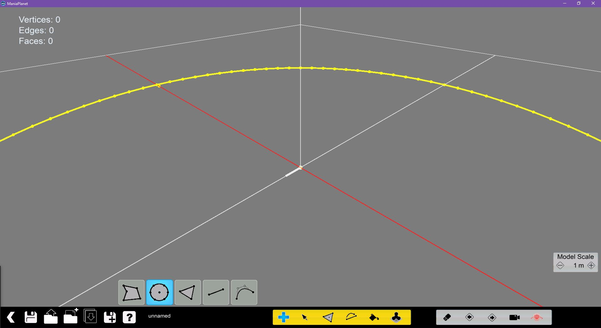

[TOC]

When you open the Mesh Modeler from the *Title Tools* menu in the menus of a Title Pack, you'll arrive on a screen like this:

For a basic usage of the mesh modeler, the most important functions are the ones indicated in the picture. We'll get back to some of the buttons later.

If you want to start to create a mesh, find the **+** on the yellow bar.

Once clicked you're in the edit mode you're free to start creating mesh.

## Creation mode

### Face Mode
In ***Face Mode*** you'll be able to draw the shape you want with straight lines.

>>>>> You can know when a parallele line is at the same end position than the one you're drawing, the other line will switch in pink.

Once you've created a form, the face corresponding to your form will transform to a face.

[//]: <> ()

### Disc Mode
This mode serve to create a circular face, its usage is very basic.

### Polygon Mode
This tool is a bit different in the way that you can modify the shape by pressing 1,2,3,4,5,6,7,8,9 to define the number of faces you want. Most of the shape will have equilateral sides.

### Edge Mode
To draw one edge at a time. Then you can fill the side you've created.

### Spline Mode
To create curved edges.

## Selection Mode

To transform it to a 3D object, select the interval you want through the ***Modal Scale*** windows on the bottom right of the screen. Be sure to have the wanted face selected click on the third button (***Extrude Selection***) in the ***Selection mode***.

## Split Mode
The Split Mode is used to subdivise a face in three faces from the click location

## Merge Points Mode
Merge the elements in the selected box you trace.

## Paint Mode
That's the mode where you can apply a texture on a face. In this mode you must select first a face, then select a texture. Once a texture is selected, click on it (the up-left box) to apply it on the face.