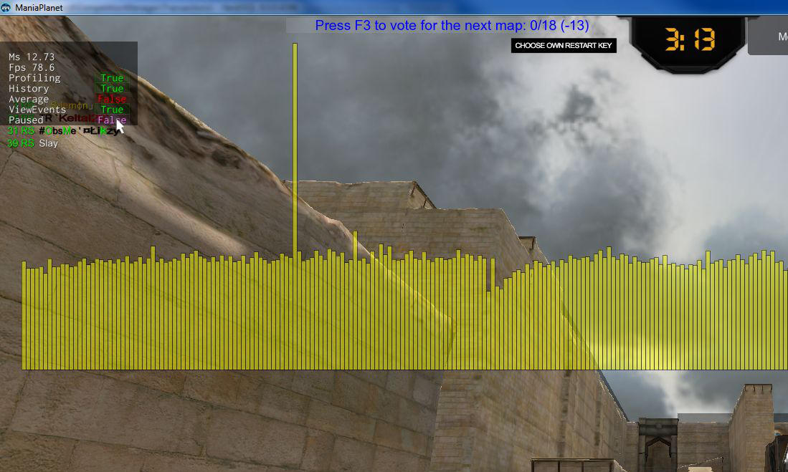

1. To start the debugger, press `Ctrl + F7`
You will have an histogram in the middle of the screen, and a little window in the top left corner:

2. When you have a micro freeze, you will have a sightly higher bar, clic on `Paused: False` to freeze the histogram.
(Press `Alt` to unlock the mouse in game)

3. When the histogram is stopped, click on the highest bar to show the detail:

4. You can click on a second bar to get a comparison:

5. Press `F10` and go to `MyDocument\ManiaPlanet\ScreenShots` folder to get the screenshot.
