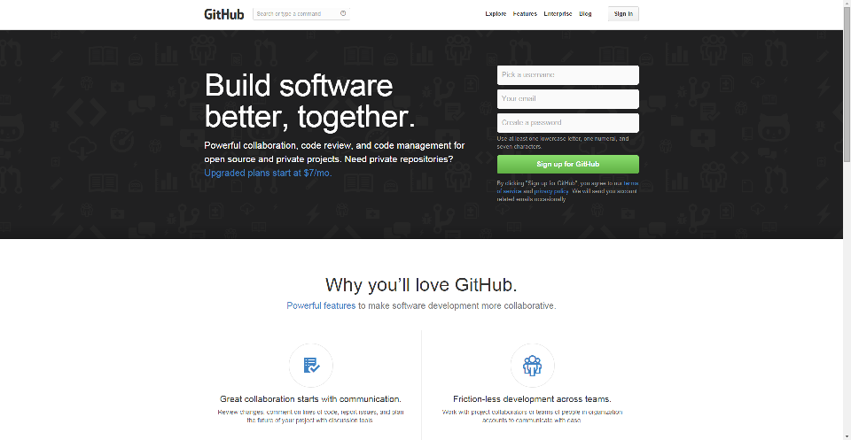

Thank you if you want to contribute to this documentation!

We'll help you to do this step by step, it's not as complicated as it seems ;)

# Setting Up
First you need to create (or connect to) a GitHub account on their website: http://github.com



Once you have done this, you must go on the documentation repository, available [at this page](https://github.com/maniaplanet/documentation), and fork it. A repository is where all the files are saved and share between all the users. If a change is done in the repository, the change will be done to all the users.

To know everything about what is a fork and how to do it, follow the guide from GitHub: https://help.github.com/articles/fork-a-repo

You can also follow the help pages for GitHub for Windows if you are using the graphical client version:

* https://help.github.com/articles/adding-repositories-with-github-for-windows
* https://help.github.com/articles/getting-started-with-github-for-windows

# Contribute to the Maniaplanet Documentation
There is few things to know if you want to contribute on this documentation.

First if you want to format the text (adding bold, italic, tables), please follow the Markdown article on GitHub help page: https://help.github.com/articles/github-flavored-markdown

Then there is few specifics on how write a page for the documentation.

If you create a new page, you must specify the layout, its title and its tags.

```md
---
layout: page
title: Contribute to the Documentation
tags: help
---
```

The differents layouts are:

* page: For a main category
* menu: For the index of a section of a main category (for example `ManiaScript` in `Creation` category.
* default: the common layout for standard page