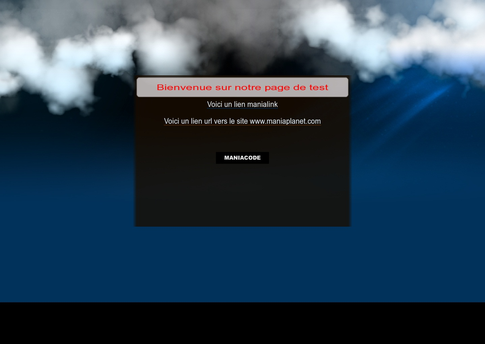

ManiaLinks are the "web pages" of ManiaPlanet.

ManiaLinks also refer to a short alias for a web page (like a domain name) in ManiaPlanet. You can register for one on [your PlayerPage][1]. 

* [Dedicated server manialinks][2]
* [Manialink actions][3]
* [Manialink Virtual Reality friendly][4]
* [Manialink styles and substyles reference (JSON)][5]

## The structure of Manialinks
ManiaLinks are basically XML files, that describe what you see on the screen. 


<?xml version="1.0" encoding="utf-8" standalone="yes" ?>
<manialink version="2">
<label text="Hello World!" />
</manialink>


The following line defines the properties of the xml that we use and its encoding format. In ManiaPlanet, we use UTF-8 because it allows the use of special characters.

<?xml version="1.0" encoding="utf-8" standalone="yes" ?>


This line defines the beginning of our ManiaLink, with the version 2. The version 1 fit with ManiaPlanet convention. Version 1 is the one used from Maniaplanet 1 to Maniaplanet 3 updates, while version 2 adds several improvements like stylesheets. In the next part of this tutorial, we will only use version 2.

<manialink version="2">


This line creates a simple label. In this case, the label will say "Hello World!". As there are no parameters added in this line, the text will be centered in height, and the letter "H" will be centered on the width.
<label text="Hello World!" />

This last line ends the definition of our ManiaLink page.
</manialink>

## The coordinates
Let's look at the cooordinates to place the elements on our page.

Version 1 and 2 of ManiaLink are made to fit on 16:9 screens. The coordinates in X go from -160 to 160, in Y from -90 to 90 and on Z from -75 to 75.

To place an element, you have to only add `posn="X Y Z"` as an attribute. X, Y and Z are the coordinates on X, Y and Z.

For the size of an element, you have to only add `sizen="X Y"` as an attribute. X and Y are the size on X and on Y.

It's possible to align an element relative to the coordinates given with `halign` in horizontal, or `vhalign` in vertical and in adding either `center`, `left`, `right` for halign, or `top`, `center`, `bottom` for vhalign. This is useful for align texts in blocks.

It is advisable to use the new standard in ManiaPlanet.

## The common tags

**\<quad\>** : allows to insert an element as a picture, a block with a background, or a ManiaPlanet element which is available on the ManiaLink `exemple`.

In the following example, we display a rectangle of 10x10 with a blue background. The color code is hexadecimal, which - unlike the color codes in player names - also has a 4th transparency value, where `F` is fully visible, and `0` is fully transparent.

<quad posn="-10 0 0" sizen="10 10" bgcolor="00FA" />


**\<frame\>** : a frame is a set of elements that we group together with the tag `\<frame\>`. A frame is a non-visible element, but we can move the ensemble of the frame, which allows you to move a whole set of elements at once.

In the following example, the first quad is placed at the location X=10, Y=10, Z=0. The second one is placed at X=-10, Y=0, Z=0, relative to the frame, so on X=0, Y=10 and Z=0 in absolute position.

<frame posn="10 10 0">
<quad sizen="10 10" bgcolor="F00A" />
<quad posn="-10 0 0" sizen="10 10" bgcolor="00FA" />
</frame>


**\<label\>** : allow to display text with differents styles which are available on the ManiaLink `exemple`.

**\<audio\>** : allow to put an audio file on a ManiaLink with a button to stop the audio. `play="1"` means that the audio will autoplay. `looping="0"` makes the audio stop when it's finished, instead of looping.

<audio data="./audio.ogg" play="1" looping="0" />


**\<music\>** : allow to put an audio file but without buttons for starting or stopping the audio, which will play automatically in the background after loading. Only ogg files or mux are supported. The line must be outside of `\<frame\>`.

<music data="./music.ogg" />


**\<include\>** : insert another xml file.

<include url="./page.xml" />


## Full example

### Content of the file example.xml


<?xml version="1.0" encoding="utf-8" standalone="yes"?>
<manialink version="2">
<include url="./background.xml"/>
<quad posn="-80 45 1" sizen="160 90" style="Bgs1" substyle="BgWindow"/>
<quad posn="-70 44 2" sizen="140 12" style="Bgs1" substyle="BgWindow2"/>
<label posn="0 40 3" halign="center" textcolor="F00" text="$wWelcome to our test page"/>
<label posn="0 30 2" halign="center" text="$h[Exemple]Link to a ManiaLink"/>
<label posn="0 20 2" halign="center" text="$l[www.maniaplanet.com]Link tou our homepage www.maniaplanet.com"/>
<label posn="0 0 2" halign="center" style="CardButtonMedium" text="Maniacode" manialink="Link inside ManiaCode"/>
</manialink>


### Content of the file background.xml


<quad posn="-160 90 0" sizen="320 180" image="./background.jpg"/>


### Result

You can download all the files [here][6].

[1]: https://player.maniaplanet.com/advanced/manialinks
[2]: server.html
[3]: actions.html
[4]: vr.html
[5]: styles.json
[6]: http://bczteam.com/~jonthekiller/Manialinks/Tutoriel_manialink.zip
