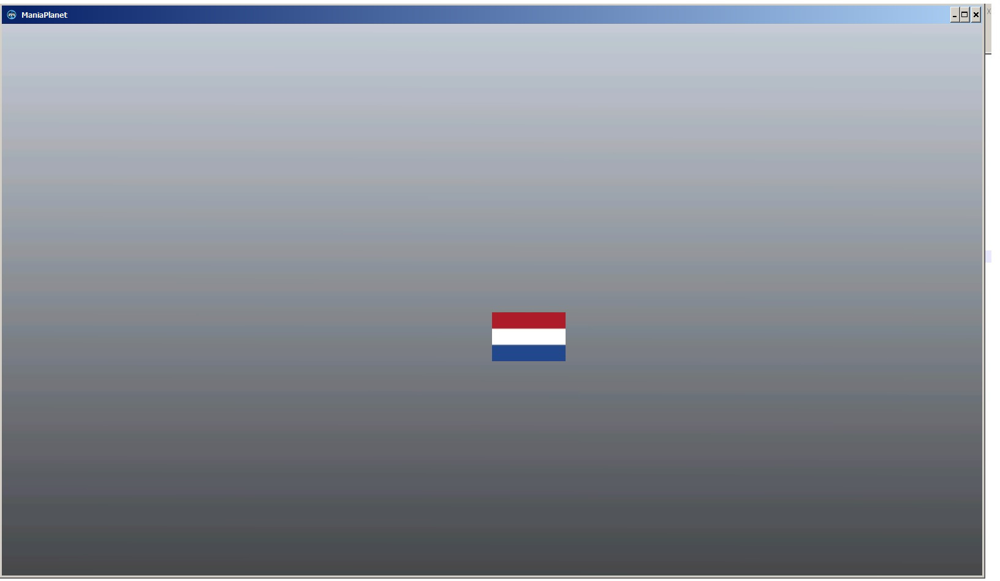
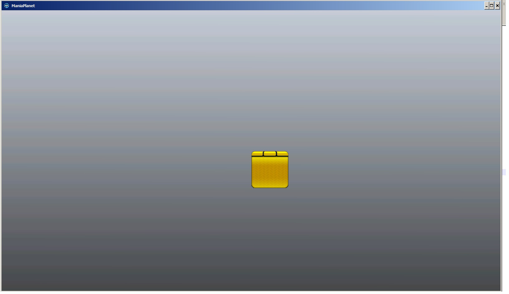

## How to get the player avatar?

`<?xml version="1.0" encoding="utf-8" standalone="yes" ?>
<manialink version="1"/>
<quad posn="0 0 1" sizen="24 24" image="file://Avatars/<PLAYER LOGIN>/default" />
</manialink>`

## How to ge the Player Country flag?

`<?xml version="1.0" encoding="utf-8" standalone="yes" ?>
<manialink version="1"/>
<quad posn="0 0 1" sizen="24 24" image="file://ZoneFlags/Login/<PLAYER LOGIN>/country" />
</manialink>`

## Echelon Show to Players

Change %d to number 1 to 9 to show echelons

`<?xml version="1.0" encoding="utf-8" standalone="yes" ?>
<manialink version="1"/>
<quad posn="0 0 1" sizen="24 24" image="file://Media/Manialinks/Common/Echelons/echelon%d.dds" />
</manialink>`
