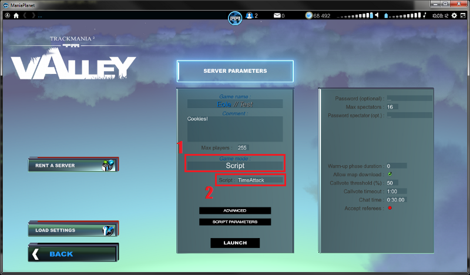
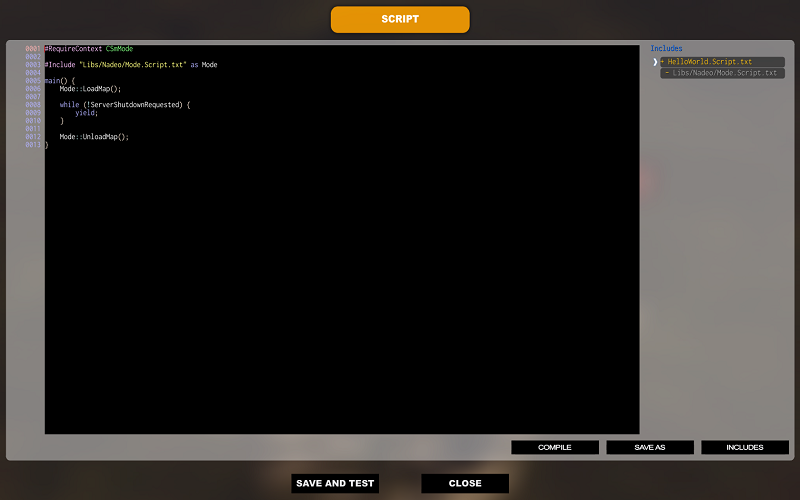

# Create a basic script

Before launching the game we will start by creating a basic rules script. Go to your ManiaPlanet custom data directory and open the `Scripts` folder. It is most likely empty, so we will create a few folders. First create a `Modes` folder and then inside another one called `ShootMania` or `TrackMania` depending on the game you want to create a mode for. It should look like this:

`ManiaPlanet\Scripts\Modes\ShootMania` or `ManiaPlanet\Scripts\Modes\TrackMnaia`

Now go into the `TrackMania` or `ShootMania` folder and create a new text file called `HelloWorld.Script.txt`. Open the file with your favorite editor and type the following code inside:

For ShootMania:

    #RequireContext CSmMode

For TrackMania:

    #RequireContext CTmMode

After this first line past this code:

    main() {
        Mode::LoadMap();

        while (!ServerShutdownRequested) {
            yield;
        }

        Mode::UnloadMap();
    }

Save the file and close your editor.

# Create a map

It's time to create a map to test our mode. Launch ManiaPlanet, start the map editor and select a maptype: `MeleeArena` for ShootMania or `Race` for TrackMania. Make a basic map, validate it and save it. Now you can exit the editor.

# Create a server

We have a basic game mode script and a map, all that is missing now is a server to do our tests. In the main menu click on the Local Play button (then Local Network if you are on TrackMania). Click on the Create button and you should see this screen:

1. Click on this box until the `Script` option is selected.
2. Click here to open a window where you can choose `HelloWorld.Script.txt`.

Once it's done click on the Launch button, select the map you created earlier and click on Play.

# Script review

If all goes right you should now see your map with a top overview. The script we wrote earlier is the minimal code to have a server running. You can press F12 to open the script editor.

Let's see in detail how it works.

`#RequireContext CSmMode` or `#RequireContext CTmMode`

When you create a script you must define what type of script it is. This is what this line is doing. We saw earlier that different script contexts exist: game mode, map type, map editor plugin and ManiaPlanet plugin. For each of these types, you have to require a specific context.
For a game mode you can choose between `CSmMode` for a ShootMania mode or `CTmMode` for TrackMania. If it is a map type, you'll have to type `CSmMapType` or `CTmMapType` depending on the game you're writing your script for. For a map editor plugin it's `CEditorPlugin` and a ManiaPlanet plugin `CManiaplanetPlugin`.

It's important to define a context for your script because you don't need the same functionalities for a game mode or a map editor plugin. By example you should be access to the list of all the existing blocks in a plugin for the map editor but not in a game mode script.

`#Include "Libs/Nadeo/Mode.Script.txt" as Mode`

Here we include what we call a library. Often when you write a script you do repetitive things. By example in a game mode you always have to load and unload maps. To do this you have to write 10 lines of code to check if a map is already loaded, start the new map, wait for the end of the loading, etc. Same thing for the unloading. To avoid the trouble of copy-pasting these 10 lines of code in all your game mode we write our recipe to load and unload the maps once and for all in an external file called a library.
Once it's done we don't have to write 10 lines of code anymore to load a map. We just have to include our library in our game mode like we saw above and we execute our loading recipe by calling its name. That's exactly what these lines do:

`Mode::LoadMap();` and `Mode::UnloadMap();`

It can be translated as: "open the mode library and execute the load map or unload map recipe".

    main() {
        [...]
    }

The `main()` block is the primary part of your script. When a server loads a script it starts by reading all the lines beginning with a `#` and after executes the code between the opening and closing braces of `main()`.

    while (!ServerShutdownRequested) {
        yield;
    }

The ManiaPlanet engine uses different components: graphic, physic, script, ... Each of these components have to take turn to execute what they have to do. So when the script engine takes its turn we have to say when we have finished our work to let the other components do their job. This is the role of the `yield;` instruction. Each time you see it, the script stops, hand over to the other components and when it's once again its turn resumes on the same `yield;`.

Around the `yield;` we can see a `while` loop. All the code between the opening and closing brace is executed in loop until we decide to stop. Here we use a `while` loop with a condition on `ServerShutdownRequested`. In brief we're asking the server to execute the `yield;` instruction in loop until someone requests to shutdown the server. When it is the case we stop the loop, call `UnloadMap()` from the mode library and exit the `main()` area. When the script quits the `main()` braces the server stops.

To sum it up the script does this in the following order:

- Define that the script is a game mode
- Include the `Mode` library
- Execute the main block code
- Load the map
- Play until someone requests to stop the server
- Unload the map
- Close the server
