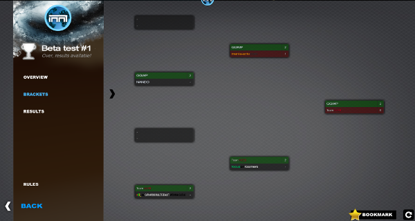
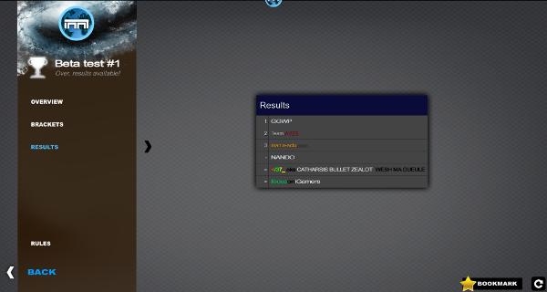
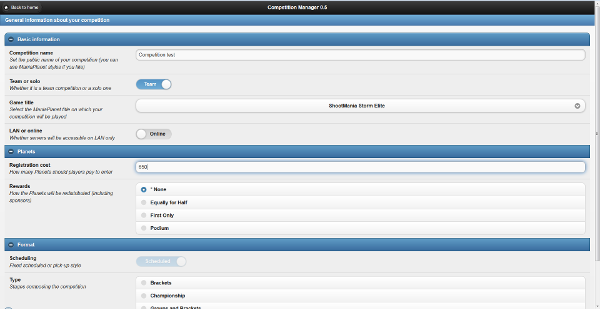

ManiaPlanet competition manager (MPCM) allows you to run automatically a cup from registrations to auto registration of results.

It bundles multiple tools:

* A web application that allow administrator (you!) to create your competition easily.
* A manialink application that allow players to register, see bracket and results.
* ManiaLive plugin to register results and manage matchs. 

## Presentation

## Instructions

### Preparation

* [Create a WebService username/password](https://player.maniaplanet.com/webservices). Do not forget to create the associated [ManiaConnect](maniaconnect.html) application. 
* Create a manialink URL which points to tour future MPCM installation. It could be `http://example.com/competitions/` or else. 
* Prepare your MySQL settings (username/password).

### Installation

#### Debian / Ubuntu 

Using our [APT repository](apt.html), install the package `maniaplanet-competition-manager`.

Once the package is installed, you have to run the setup script: `$ php /var/lib/maniaplane-competition-manager/setup.php`

When asked, enter the folowing settings:

* Dedicated path: `/opt/maniaplanet-server/`
* ManiaLive path: `/opt/manialive/`

An [Apache alias](https://httpd.apache.org/docs/2.4/mod/mod_alias.html) has been created by the package. You shoud be able to access <http://yourdomain.com/maniaplanet-competition-manager/> in your browser. 

#### Other

1. Download latest [Maniaplanet competition manager package](http://code.google.com/p/maniaplanet-competition-manager/downloads/list).
2. Extract it where you want.
3. Run the setup script. It will create `app.ini` file in the `config/` directory. You can modify the file but running the setup script again will erase your modifications. 
It will also create the `CompetitionManager` MySQL base and table. It it does not work, you can execute `competition.sql`. 

## Help

You can get help on the [Dedicated Server Tools forum](http://forum.maniaplanet.com/viewforum.php?f=463).